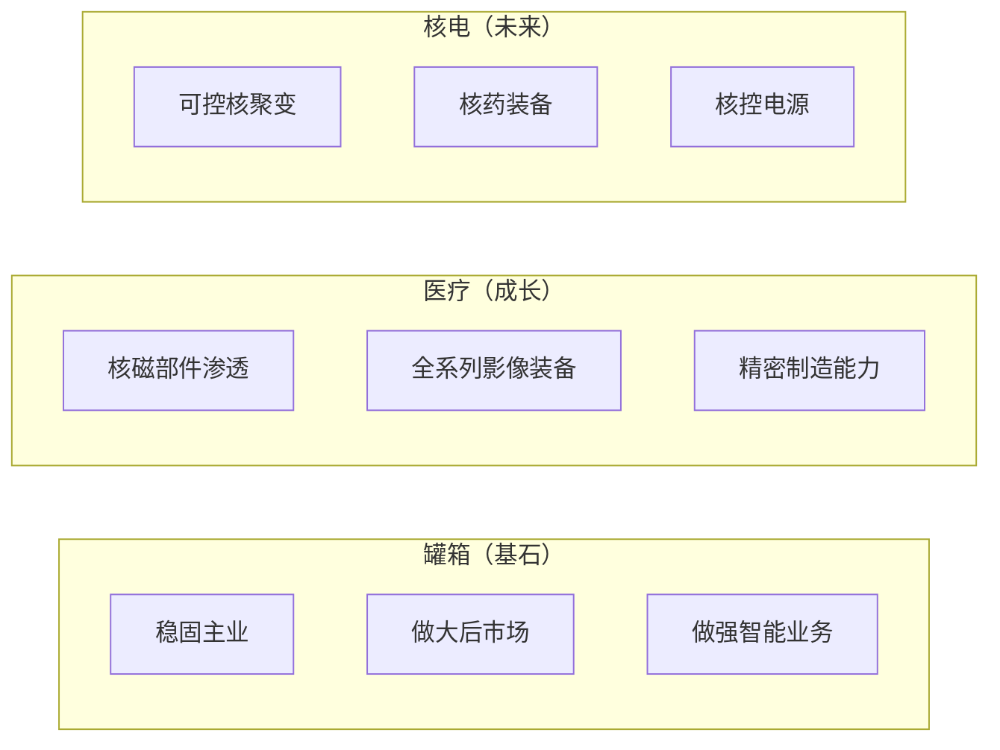

# 战略规划与投资布局

> [!abstract] 概述
> 2025年明确的中长期战略方向和募投项目进展，为26年及以后的战略执行提供路线图。

## 中长期战略框架

### 三大发展方向

### 增长路线图

| 年份 | 营收目标 | 关键里程碑 |
|------|----------|------------|
| 2025实际 | 23.89亿 | 基线年 |
| 2026 | 31.33亿 | 方针落地、并购并表 |
| 2027 | ==75亿== | 新一代ISO罐箱占比>30% |
| 2030 | ==100亿+== | 多元化业务成熟 |

## 募投项目进展

### 绿洲产线智能化升级（喷粉车间）

| 维度 | 数据 |
|------|------|
| 启动时间 | 2021年4月 |
| 投产 | 2023年5月试生产，2024年验收 |
| 总投资 | ==5,638万== |
| 单台成本 | ~1,774元（粉末31%/能耗29%/折旧18%/人工13%） |
| 对比油漆工艺 | 节约==346元/台== |
| 2024年以来累计 | 喷粉22,106台，总节约额~==1,021万== |

> [!success] 投资回报已验证
> VOCs超低排放 + 每台节约346元，累计节约超1,000万。

### 有色金属精密制造中心

- 2024年9月启动（临时租赁厂房）
- 激光切割/折弯/剪板/冲床已投用
- 2025年5月箱类外协加工件==全部转自制==（薄板除外）
- V型防波板自动折弯系统首台验收，批量投产
- 初步统计：自制成本费率略低于外协费率 + 余废料再利用

### 特种罐箱绿色柔性灯塔工厂

| 状态 | 说明 |
|------|------|
| 原计划 | 2025年8月完成技术/商务合同 |
| 实际 | ==重新评估投资强度与节奏== |
| 前置条件 | 梦七项目和端框车间搬迁 |
| 26年进展 | 控股变更审批已完成，5月发标 |

### 后市场连云港堆场

> [!danger] 教训案例
> 项目已结题，仍处亏损。==前期可研报告对风险揭示不足==，仅提示环保政策成本风险，未充分关注收入来源前提（园区发展不及预期）。小股东已提出退出需求。

### 其他募投项目

- 高端医疗装备优化项目 — 进行中
- 修箱车间原厂维修和增值改造 — 进行中
- 研发中心扩建 — 进行中
- 数字化运营升级 — 子项目持续（IoT、关务合规等）

## 年度技改投资

| 业务 | 批复额 | 累计实施 | 使用率 |
|------|--------|----------|--------|
| 罐箱 | 1,261万 | 158万 | 12.6% |
| 医疗 | 33万 | 17万 | 51.7% |
| 智能 | 20万 | 20万 | 99.9% |
| 后市场 | 336万 | 91万 | 27.0% |
| **合计** | **1,650万** | **289万** | **17.5%** |

> [!warning] 投资执行率偏低
> 全年技改投资执行率仅17.5%，主要因罐箱业务"视业务情况谨慎投资"。

## 2026年组织架构重组

来源：2026开工大会报告

- 重组为 ==3事业部 + 6职能部门==
  - 化工装备事业部（10部门）
  - 医疗装备事业部
  - 创新业务事业部
- 化工装备下设：营销中心（由平台划入）、技术中心（与创新实验中心合并）、采购物流中心（供应链中心合并）等

## 相关链接

- [[新业务拓展与并购]] — 并购储备项目
- [[总经理要求与战略目标]] — 26年战略框架
- [[组织架构与职责]] — 26年组织架构
- [[25年工作信息存留 MOC|← 返回25年存留]]
