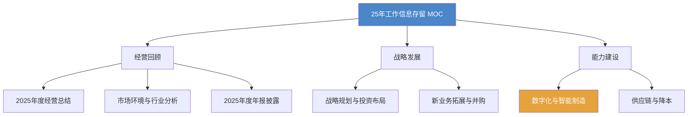

# 25年工作信息存留 MOC

> [!abstract] 概述
> 中集环科2025年度工作信息存留，提炼自半年度/三季度/全年总裁工作报告及2026开工大会报告。为26年工作提供**历史基线与经验参照**。

## 知识体系

## 经营回顾

| 笔记 | 核心数据 |
|------|----------|
| [[2025年度经营总结]] | 营收==23.89亿==（-28.65%）、净利润==1.13亿==（-62.91%） |
| [[市场环境与行业分析]] | 化工周期低迷、罐箱需求下滑、关税博弈、产能过剩 |
| [[2025年度年报披露（301559）]] | 上市公司年报：三年趋势、分红7.71亿、现金流+137%、资产负债率13.7% |

## 战略发展

| 笔记 | 核心内容 |
|------|----------|
| [[战略规划与投资布局]] | 2030年100亿目标、罐箱+医疗+核电三大方向、募投项目进展 |
| [[新业务拓展与并购]] | 50+调研、10+储备、星环聚能3000万、6大赛道布局 |

## 能力建设

| 笔记 | 核心内容 |
|------|----------|
| [[数字化与智能制造成果]] | RPA效率+45%、订单级毛利测算、防波板效率+400%、5G工厂认证 |
| [[供应链与降本成果]] | 综合采购成本-4%、阀门-25%、单箱设计成本-1,100+元 |

## 关键经验教训（26年参照）

> [!important] 25年→26年的经验传递
> 1. **罐箱价格持续低位**：25年标罐均价下滑11.9%，26年箱价仍在USD 1.38万低位
> 2. **产能利用率决定利润**：25年产能不足→单箱分摊增加→26年Q1仅38%需关注
> 3. **医疗是确定性增长极**：连续创历史新高，25年2.53亿→26年目标2.7亿
> 4. **降本有实效**：采购-4%、阀门-25%、设计-1,100元可横展
> 5. **投并购节奏**：25年立题1项（天津开利达），26年目标7月并表需加速
> 6. **连云港堆场教训**：前期风险揭示不足，收入来源前提未充分论证

## 与其他知识区的关联

| 知识区 | 关联点 |
|--------|--------|
| [[26年工作区 MOC]] | 26年目标的基线数据来源 |
| [[采购优化 MOC]] | 供应链降本的方法论支撑 |
| [[瑞俊的数字化管理课 MOC]] | 数字化转型的理论基础 |
