# 26年工作区 MOC

> [!abstract] 概述
> **中集环科（CIMC Enric）2026年度商业计划**工作区。涵盖公司方针、重点行动计划、经营数据及会议纪要，面向智能体结构化调用。

## 知识体系

```mermaid
graph TB
    MOC[26年工作区 MOC] --> SF[战略框架]
    MOC --> AP[重点行动计划]
    MOC --> BD[经营数据]
    MOC --> MN[会议纪要]
    MOC --> CR[总裁报告]

    CR --> CQ1[Q1总裁工作报告]
    CR --> CQ2[Q2总裁工作报告]
    CR --> CQ3[Q3总裁工作报告]
    CR --> CQ4[Q4总裁工作报告]

    SF --> GM[总经理要求与战略目标]
    SF --> GP[2026年公司方针总览]
    SF --> OG[组织架构与职责]
    SF --> KPI[考评体系与绩效合同]
    SF --> LT[中长期战略规划 2026-2029]

    AP --> A1[增收—渗透率提升]
    AP --> A2[增收—新市场新领域]
    AP --> A3[增收—多元化业务]
    AP --> A4[减支—成本领先]
    AP --> A5[固本—制造与HSE]
    AP --> A6[培元—创新与数字化]

    BD --> Q1[Q1经营指标]
    BD --> EP[E项目改善跟踪]

    MN --> M1[方针细化讨论会]
    MN --> M2[双碳数字化讨论会]
    MN --> M3[E项目W13例会]
    MN --> M4[商业计划及组织优化交流会]

    style MOC fill:#4a86c8,color:#fff
    style A6 fill:#e6a23c,color:#fff
    style EP fill:#67c23a,color:#fff
    style LT fill:#f56c6c,color:#fff
```

## 战略框架

| 笔记                     | 核心内容               | 关键数字                       |
| ---------------------- | ------------------ | -------------------------- |
| [[总经理要求与战略目标]]         | "2+2+N"战略、增长路线图    | ==27年75亿、29年100亿==         |
| [[2026年公司方针总览]]        | 19项方针（增收/减支/固本/培元） | 4大类 × 19项                  |
| [[组织架构与职责]]            | 三层架构、部门-负责人映射      | 经营层/能力层/使能层                |
| [[考评体系与绩效合同]]          | ==v3.1 签署版（2026.4.12）== 双轨KPI(固本+培元) + OKR(战略主题) + 能力突破 + 底线合规  | 28个考核实体（事业部17部门已量化签署）                    |
| [[2026年部门绩效合同签署版季度目标明细]] | ==v3.1 签署版== 17部门 KPI/OKR 季度目标分解 | 17部门 × (9 KPI + 7 OKR 均值)       |
| [[中长期战略规划（2026-2029）]] | 罐箱+医疗+核电三赛道，2029目标 | ==100亿营收、9.2亿利润、333.5亿市值== |

## 重点行动计划

| 类型 | 笔记 | 方针编号 | 核心目标 |
|------|------|----------|----------|
| 增收 | [[增收—渗透率提升]] | #1~#2 | 罐箱份额>60%、医疗≥2.7亿 |
| 增收 | [[增收—新市场新领域]] | #3~#5 | 国内份额>50%、新场景>2、NMR≥1000万 |
| 增收 | [[增收—多元化业务]] | #6~#8 | 旧箱回收、后市场、并购并表>3000万 |
| 减支 | [[减支—成本领先]] | #9~#10 | 人效+10%、外汇风险管控 |
| 固本 | [[固本—制造与HSE]] | #11~#16 | 产能建设、质量领先、双碳减排 |
| ==培元== | [[培元—创新与数字化]] | ==#17~#19== | ==数字化覆盖率100%、新产品>5项== |

## 经营数据

| 笔记 | 覆盖期 | 关键指标 |
|------|--------|----------|
| [[Q1经营指标]] | 2026年1-3月 | 营收达成61%、净利润-517万、在手11,648台 |
| [[E项目改善跟踪]] | 持续 | 3,150台、单台收益¥4,000、总收益¥1,200万 |

## 会议纪要

| 笔记 | 日期 | 主题 |
|------|------|------|
| [[方针细化讨论会 2026-03-06]] | 2026-03-06 | 19项方针细化、颗粒度到周 |
| [[双碳数字化讨论会 2026-01-07]] | 2026-01-07 | CBAM政策、双碳二期、IoT蓝图 |
| [[E项目利润计划周例会 2026-03-27]] | 2026-03-27 | W13改善进展、产能规划、费用分析 |
| [[商业计划汇报会议 2026-04-01\|商业计划及组织优化交流会]] | 2026-04-01 | Q1经营、控股领导七项要求、铁三角机制、需求重塑 |

## 总裁报告

| 季度 | 报告 | 状态 | 核心议题 |
|------|------|------|----------|
| Q1 | [[2026年Q1总裁工作报告]] | ==编制中== | 订单暴增+罐箱缺口预警+数字化启动 |
| Q2 | [[2026年Q2总裁工作报告]] | 待编制 | — |
| Q3 | [[2026年Q3总裁工作报告]] | 待编制 | — |
| Q4 | [[2026年Q4总裁工作报告]] | 待编制 | — |

> 专区索引：[[总裁报告 MOC]]

## 与其他知识区的关联

| 知识区 | 关联点 |
|--------|--------|
| [[采购优化 MOC]] | 策略采购降本10%、E项目BOM优化、阀门国产化 |
| [[瑞俊的数字化管理课 MOC]] | 数字化转型蓝图、决策融合、数据治理 |

---

> [!tip] 智能体调用说明
> 本工作区所有笔记均使用结构化 frontmatter（type/tags/status/owner/priority），支持通过属性过滤快速检索。每篇笔记的 `## 关键决策点` 部分汇集了需要关注的核心问题。
