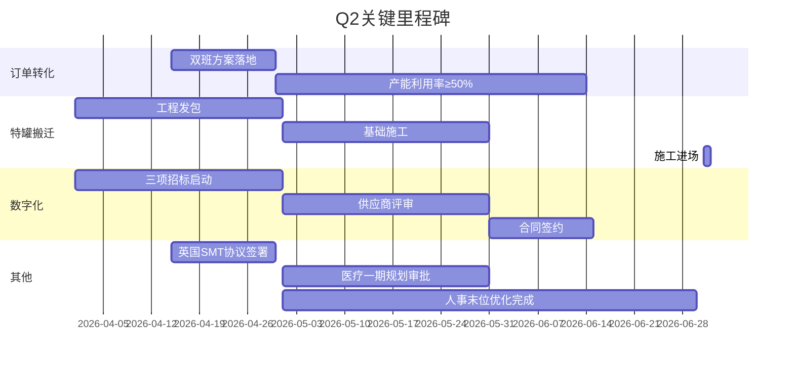

# 2026年一季度总裁工作报告

> **中集安瑞环科技股份有限公司**
> 报告期：2026年1月-3月 | 编制日期：2026年4月
> 提报：总经理 季国祥

---

## 一、形势研判与经营基线

> [!abstract] 本章逻辑
> **外部验证 → 基线校准 → 全年预测校准**。先用宏观与行业数据说明Q1"前低后高"是行业共性，再给出客观经营基线，最后校准全年预期。

### 1.1 外部环境速描

#### 宏观经济：前低后高，3月强劲反弹

| 指标 | 1月 | 2月 | 3月 | Q1信号 |
|------|-----|-----|-----|--------|
| **官方制造业PMI** | 49.3 | 49.0 | ==50.4== | 前两月收缩→3月重回扩张，为过去一年最强读数 |
| **财新制造业PMI** | 50.3 | 52.1 | 50.8 | 连续3个月扩张，中小企业动能持续 |
| **3月新订单指数** | — | — | ==51.6== | 较2月+3.0pp，需求端明确回暖 |
| **3月新出口订单** | — | — | 49.1 | 较2月(45.0)+4.1pp，外需边际改善 |
| **1-2月出口** | 同比+21.8% | — | — | 大幅超预期，东南亚+欧洲拉动 |
| **1-2月工业企业利润** | 同比+15.2% | — | — | 下游客户支付能力改善 |

> [!tip] 对环科的含义
> PMI"前低后高"与环科Q1经营节奏**完全同步**——1-2月标罐需求低迷（仅达成33.8%）对应制造业收缩，3月订单暴增4,552台对应PMI重回扩张。**Q1困难是行业周期共性，非公司个体问题。**

#### 罐箱行业：全球产量连降，欧洲化工产能加速东移

| 维度 | 数据 | 来源 |
|------|------|------|
| 全球船队规模 | 截至2025.1.1达**882,023台**，净增33,620台（上年46,600台） | ITCO 2026 Fleet Report |
| 全球年产量 | 2024年制造42,123台、报废8,500台，连续第二年下降 | ITCO |
| 老旧淘汰 | 高车重、低容量旧罐加速退出，报废量创近年新高 | ITCO |
| 欧洲化工危机 | 产能闭停**6倍增长**；BASF Ludwigshafen重组裁员3,300人；Domo破产；Shell/Ineos/ExxonMobil关停多厂 | SCI |
| 霍尔木兹海峡 | 2月底因伊美冲突几近关闭，油轮/化学品通行暴跌40-70% | 行业报告 |
| ITCO主席判断 | "市场面临significant economic and geopolitical headwinds，化工行业调整比预期更深" | ITCO Journal Q1 2026 |

**战略含义：**
1. 欧洲化工产能向亚洲转移（BASF湛江€100亿投资）→ 中国本土化工罐箱需求有**结构性支撑**
2. 老旧罐淘汰加速 → 旧箱回收业务(方针#6)**时间窗口打开**
3. 全球产量下降+船队老化 → 化工周期复苏时，罐箱补库需求将**集中爆发**
4. 霍尔木兹中断 → 供应链多元化需求提升，灵活联运优势凸显

#### 原材料与汇率

**不锈钢 304/316：**

| 时点 | 304冷轧(元/吨) | 驱动因素 |
|------|----------------|---------|
| 2025年12月 | ~14,200 | 基线 |
| 2026年1月 | ==14,530== | 印尼镍矿配额缩减30%推高镍铁至1,100+元/镍 |
| 2026年3月 | ~13,200 | 现货跟涨乏力，利润回归盈亏平衡 |
| Q2展望 | 偏弱震荡 | 季节性需求放缓+高库存负反馈 |

> Q1核心矛盾："**成本强支撑 vs 需求弱拖累**"。对环科而言，原材料价格高位震荡增加采购成本，但Q2若价格回落有利于降本。

**汇率（USD/CNY）：**

| 时点       | 汇率            | 事件                      |
| -------- | ------------- | ----------------------- |
| 2025年12月 | ~7.00         | 基线                      |
| 2026年1月  | ~6.93         | 离岸人民币破7，持续升值            |
| 2026年2月  | ==6.84==      | 在岸离岸双破6.84，创2023年4月以来新高 |
| 2026年3月底 | ~6.85         | 季末稳定                    |
| 机构预测     | 6.70-6.85（年底） | 高盛6.70 / 汇丰6.75         |

> **Q1人民币升值约2%**。核心驱动：美最高法院裁定IEEPA关税违法→美元系统性走弱+中国贸易顺差破万亿+结汇潮集中释放。
> **对环科影响**：罐箱以USD报价，Q1汇率升值约侵蚀收入1,300-1,500万元；但进口设备采购（涂装线等）成本降低，特罐搬迁项目部分受益。

**中美贸易：**
- 2026.2.20：美最高法院裁定IEEPA关税违法 → 白宫同日转用Section 122对全球加征10%关税
- 对华关税从IEEPA的20%→Section 122的10%，**实际税负略降**
- 301/232条款仍在，不确定性持续；中方"保留一切必要措施权利"

#### 医疗设备行业

- 2025年Q1中国MRI市场3.0T高端设备销额占比70.78%，国产化加速
- 联影医疗市占率升至24.31%（+6.31%），GPS合计降至63.1%
- 国产替代趋势确立，**联影高增长对环科医疗装备事业部是增量机会**

### 1.2 Q1经营基线

| 指标 | Q1实际 | 年度目标达成 | 同比变化 | 全年目标 |
|------|--------|------------|---------|---------|
| **营业收入** | ==55,706万== | 18% | ==-9%== | 预算目标 |
| **净利润** | ==2,236万== | 9% | +1% | 预算目标 |
| **ROA / ROE** | 1.6% / 2.0% | — | 持平 | — |
| **CCC（母公司）** | ==112天== | — | ==-27天== | ≤113天(目标) |
| **经营性净现金流** | ==-19,603万== | — | — | 25,000万 |
| **新签订单（台）** | ==6,846台== | — | ==+204.1%== | 20,000台 |
| **新签订单（金额）** | — | — | ==+120.2%== | — |
| **在手订单（金额）** | — | — | ==+118.3%== | — |
| **产能利用率** | ==38%== | — | — | ≥70%(目标) |

> [!tip] 3月扭亏为盈
> 1-2月净亏损-517万，3月单月盈利==2,753万==（环比+737%），Q1累计扭亏为盈。3月单月收入25,017万，几乎等于1-2月合计。**3月是Q1的关键拐点，验证了"前低后高"判断。**

### 1.3 关键亮点

1. **3月扭亏为盈**：1-2月净亏-517万→3月盈利2,753万→Q1累计+2,236万，完成年度目标9%，同比+1%。**盈利模型在业务量恢复后成立**
2. **订单强劲回升**：Q1新签6,846台（同比+204%），订单金额同比+120.2%。其中3月单月4,552台，创近年新高。运营商+租赁商占比88.7%，客户结构健康
3. **医疗业务超预期**：收入预算达成95.4%（同比+39.6%），新签订单金额同比+132.4%，第二增长曲线明确
4. **CCC大幅改善**：112天，同比下降27天，优于指标1天。现金管理成效显著
5. **智能业务爆发**：预算达成94.9%（同比+305.2%），IoT与AI赋能初见成效
6. **特罐搬迁获批**：总投资9,980万元，3月完成控股审批，预计2027春节后投产

### 1.4 核心挑战

1. **收入同比转负**：Q1累计55,706万，同比==-9%==（1-2月曾+7.3%），3月高基数效应拉低同比，全年收入压力仍大
2. **量价背离显著**：新签订单台数+204%但金额仅+120.2%，反映箱价下行侵蚀单台收入
3. **产能利用率严重偏低**：仅38%，对标损失约==6,000万元/年==。3月业务量回升验证了产能利用率是盈利的核心杠杆
4. **经营性现金流大幅为负**：Q1净现金流-19,603万，年度预算25,000万，Q2-Q4须强力回正
5. **箱价下行+人民币升值双重挤压**：标罐均价USD 1.38万 × 汇率从7.0→6.85，**每台收入折人民币减少约¥2,000**

### 1.5 全年预测校准

| 指标 | 年初预算 | Q1基线预测 | 缺口 | 校准依据 |
|------|---------|-----------|------|---------|
| **罐箱收入** | ~24.6亿 | ~13.2亿 | ==-11.5亿== | Q1实际+行业产量趋势 |
| **罐箱毛利** | — | -3,014万 | ==-2.7亿== | 箱价下行+汇率侵蚀 |

> [!warning] 关键判断
> 3月数据**已验证拐点**：单月收入25,017万（≈1-2月总和），单月净利2,753万扭亏为盈。但Q1整体收入同比仍为-9%，说明1-2月基数效应仍在拖累。Q2随订单持续转化为交付，收入有望加速回升。

---

## 二、业务运营

### 2.1 整体经营表现

> [!info] 数据口径说明
> 公司整体Q1完整数据来自3月董事会月报；各业务线达成率为1-2月口径（3月分业务数据待补充）。

**Q1公司整体（1-3月完整）：**

| 指标 | Q1累计 | 年度目标达成 | 同比 |
|------|--------|------------|------|
| 营业收入 | ==55,706万== | 18% | -9% |
| 净利润 | ==2,236万== | 9% | +1% |
| CCC | 112天 | — | -27天 |
| 经营性净现金流 | -19,603万 | — | — |

**各业务线表现（1-2月口径）：**

| 业务线 | 收入达成 | 同比 | 净利润(万) | 评价 |
|--------|---------|------|-----------|------|
| **罐箱业务** | 56% | +3.5% | -1,809 | 标罐严重低于预期，3月业务量回升 |
| **医疗装备** | ==95.4%== | +39.6% | 达成85.5% | 超预期，订单金额同比==+132.4%== |
| **智能业务** | ==94.9%== | +305.2% | — | 爆发增长 |
| **后市场** | 86% | — | — | 基本达标 |
| **合计（1-2月）** | 61% | +7.3% | ==-517== | 1-2月亏损，3月扭亏 |
| **合计（Q1完整）** | ==18%(年度)== | ==-9%== | ==+2,236== | **Q1累计盈利** |

### 2.2 罐箱业务详析

#### 分产品线表现（1-2月）

| 产品线 | 预算达成 | 同比变化 | 关键问题 |
|--------|---------|---------|---------|
| **标罐** | ==33.8%== | ==-26.9%== | 需求疲软，箱价下滑 |
| **特罐** | ==84.7%== | ==+44.4%== | 表现亮眼 |
| **气体碳钢罐** | 54.2% | -43.3% | 需关注 |
| **外销封头** | 75.2% | — | 基本稳定 |

#### 订单结构

| 指标 | 数据 |
|------|------|
| 外销占比 | 93.8% |
| 运营商+租赁商占比 | 88.7% |
| 标罐均价 | USD 1.38万 |

### 2.3 医疗装备事业部

| 指标 | Q1实际 | 目标 |
|------|--------|------|
| 收入达成率 | 95.4% | 年度≥2.7亿（季度节奏Q1>6000万） |
| 净利润达成率 | 85.5% | — |
| 新签订单同比 | +183.1% | 持续增长 |
| 核心客户 | 西门子/联影/飞利浦稳定供货 | — |

**Q1核心客户产品开发进展：**
- **西门子**：OR135正在打样，OR107预研讨论中
- **联影**：ML16正在打样，F1正在打样阶段
- **飞利浦**：Maxwell组件项目正在做PQR（焊接工艺评定）
- **新客户拓展**：万东/美的医疗已交付新款少液氦磁体筒体样品；合肥中科院下属曦合超导接触中

> NMR新赛道Q3布产线。联影医疗市占率快速提升（24.31%），环科作为核心供应商将共享增长红利。

### 2.4 订单-收入转化管道（Pipeline视图）

> [!abstract] Q1核心矛盾的解
> 订单暴增(+204%)但收入滞后(61%)，是典型的Pipeline充盈期。下表展示从订单到收入的转化时序。

| 管道阶段 | 台数 | 预计转化收入 | 预计交付窗口 | 状态 |
|----------|------|-------------|-------------|------|
| **在手订单** | 11,648 | 待测算 | Q2-Q3 | 排产中 |
| **Q2预期新签** | 待预测 | 待测算 | Q3-Q4 | 基于3月订单趋势外推 |
| **全年目标** | 20,000 | — | — | Q1已完成34.2% |

> **关键转化条件**：产能利用率从38%→55%+（需双班方案4月落地），否则在手订单无法消化。

### 2.5 五大弥补举措

| 举措 | 预期增利 | 责任人 | Q1进展 |
|------|---------|--------|--------|
| 1. 市场开拓（再签~10,000台） | ==+8,000万== | 包秋婧 | 3月订单暴增，趋势向好 |
| 2. 产能利用率提升（38%→目标） | ==+6,000万== | 林爱彬 | 双班规划中 |
| 3. E项目降本（3,150台×¥4,000） | ==+1,200万== | 黄红如 | 5项已完成，3项推进中 |
| 4. 策略采购降本 | 待量化 | 刘建中 | 钢厂锁价+阀门锁定1万台 |
| 5. 设计/工艺优化降本 | 待量化 | 陈晓春/杨殿伟 | 课题梳理中 |

---

## 三、战略举措：布局成熟度评估

> [!abstract] 本章逻辑
> Q1是**布局期**——19项方针多数处于方案制定和资源准备阶段。本章用**成熟度仪表盘**呈现布局进展，而非简单罗列"规划中"。成熟度 = 从目标到执行的就绪程度。

### 3.0 布局成熟度总览

```
★☆☆☆ 目标已定（25%）  ★★☆☆ 方案已定（50%）  ★★★☆ 资源已锁（75%）  ★★★★ 执行中（90%+）
```

| 主题     | #   | 方针     | 成熟度      | Q1关键里程碑                             | Q2目标           | 关键卡点        |
| ------ | --- | ------ | -------- | ----------------------------------- | -------------- | ----------- |
| **增收** | #1  | 核心客户渗透 | ★★★☆ 75% | 分析框架完成、售后协议更新、南钢战略协议、钢厂/FV交流机制建立    | 客户访谈+铁三角落地     | 箱价策略待决策     |
|        | #2  | 医疗存量   | ★★★★ 90% | 收入达成95.4%，订单+183%                   | 飞利浦新客户落地       | —           |
|        | #3  | 国内罐箱   | ★☆☆☆ 25% | <!-- 待业务部门补充 -->                    | 营销策略+激励机制      | 方案未出        |
|        | #4  | 新场景    | ★★☆☆ 40% | 医药箱/粉末运输洽谈中                         | 首个场景签约         | 技术可行性验证     |
|        | #5  | NMR新赛道 | ★★☆☆ 40% | 客户开拓中                               | Q3产线布局启动       | 投资审批        |
|        | #6  | 旧箱回收   | ★★★☆ 65% | 海特56台签约；拆解工艺梳理启动                    | 拆解方案落地+300台    | 欧洲vs国内路径待定  |
|        | #7  | 后市场    | ★★★☆ 70% | 收入86%；南京清洗工艺确定；厦门+青岛立项报控股           | 堆场盈亏平衡         | —           |
|        | #8  | 创新并购   | ★★★☆ 55% | 医疗方向确定；投资管理制度签批完成                   | 7月前并表          | 尽调进度紧张      |
| **减支** | #9  | 降本增效   | ★★★★ 85% | E项目5/11完成+3项新增                      | 全产品线复制         | —           |
|        | #10 | 外汇管理   | ★★★☆ 70% | 汇率周会启动；套保组合运行                       | 人民币合同推广        | 客户接受度       |
| **固本** | #11 | 产能建设   | ★★★★ 90% | 特罐搬迁控股审批完成                          | 4月启动/7月施工      | —           |
|        | #12 | 工艺能力   | ★★☆☆ 50% | 工艺平台立项；前置管理确定                       | 结构化平台开发        | 跨部门协调       |
|        | #13 | 质量管理   | ★★☆☆ 45% | QMS立项招标中                            | 供应商签约          | 选型待定        |
|        | #14 | 后市场运营  | ★★☆☆ 40% | 撬装清洗装置推进中                           | 样机测试           | —           |
|        | #15 | 安全风险   | ★★★☆ 65% | HSE数字化平台应用中                         | AI监测预警方案       | —           |
|        | #16 | 环保减碳   | ★★★☆ 60% | CBAM数据申报要求确认                        | 系统匹配率→80%      | 系统目前仅60-70% |
| **培元** | #17 | 精益创新   | ★★★☆ 65% | 核聚变氦气罐==已完成==                       | 模块化产品开发启动      | —           |
|        | #18 | 数字化转型  | ★★★☆ 55% | 规划v0.1完成；IoT商务标开标+4/10签约；数据治理三家伙伴确定 | IOT/DR/QMS实施启动 | 资源协调        |
|        | #19 | 长期储备   | ★★☆☆ 35% | 核电+医疗新业务两方向启动；保密协议签署                | 方向锁定+立题≥1      | 技术可行性       |

> [!summary] 布局成熟度总评
> - **执行中(90%+)**：3项（#2医疗、#9降本、#11产能）→ 已进入收获期
> - **资源已锁(65-75%)**：6项（#1核心客户、#6旧箱、#7后市场、#10外汇、#15安全、#17创新）→ Q2可立即转入执行
> - **方案已定(50-60%)**：5项（#8并购、#12工艺、#16环保、#18数字化、#19储备）→ Q2核心攻坚区
> - **目标已定(25-45%)**：5项（#3国内罐箱、#4新场景、#5NMR、#13质量、#14后市场运营）→ 需加速推进
>
> **Q1完成了"战略到方案"的转化，Q2的任务是"方案到行动"的落地。**

### 3.1 增收方针详情

#### 方针#1：罐箱核心客户渗透（目标：市占率≥60%）

| 举措 | Q1进展 | 下一步 |
|------|--------|--------|
| 化工行业趋势预判报告 | 3/29完成分析框架 | 4/12编写客户访谈问题，列出采访客户清单 |
| 策略采购降本10% | 3月完成与钢厂交流机制及后续每月计划；完成与FV(阀件厂)交流机制；E项目标贴、密封胶特殊折扣商谈完成 | 4/30前制定年度合作计划 |
| 设计/工艺优化降本10% | 设计端3/31明确降本目标；工艺端完成标/特/碳罐低值易耗品现状调研+问题清单+根因分析 | 5/10形成方案跟踪表 |
| 报价流程优化 | 3月底完成2025年报价毛利偏差率整理+问题诊断 | 毛利偏差<±5%的报价单占比≥70% |
| 客户投诉联动响应 | 3/25完善售后签报流程；质量保证协议已更新（增加响应/解决时间），已通知供应商4月底签回 | 响应<1天，解决<7天 |
| 材料备库+成品预投 | 3月与南钢签署战略合作协议；组织各部门推进备货工作 | 标准品7天、非标45天交期 |
| 融资配套零丢单 | Q1与深圳融资租赁公司启动2台罐箱租赁合作 | 打通"内借外用"流程 |

#### 方针#2：医疗存量（目标：≥2.7亿）

| 指标 | Q1目标 | Q1实际 | 评价 |
|------|--------|--------|------|
| 销售收入 | >6,000万 | 预算达成95.4% | 达标 |
| 新签订单 | — | 同比+183% | 超预期 |

#### 方针#3-#5：新市场/新领域

| 方针 | Q1进展 |
|------|--------|
| #3 国内罐箱市场（>50%份额） | <!-- 待业务部门补充 --> |
| #4 新场景（>2个） | 医药箱、粉末运输等洽谈中 |
| #5 NMR新赛道（≥1000万） | Q3布专用产线，新客户≥2家目标 |

#### 方针#6-#8：多元化业务

| 方针 | Q1进展 |
|------|--------|
| #6 旧箱回收（>1000台） | 已完成海特==56台==旧箱回收合同签署；洽谈君正、外运；拆解工艺流程梳理中 |
| #7 后市场（>1.9亿） | Q1收入达成86%；南京堆场完成清洗设备调研+清洗工艺确定；连云港与洋井达成经营策略转变共识+盛虹退租协商；==厦门+青岛堆场项目==内部立项并提交战投会审议 |
| #8 并购并表（>3000万利润） | 医疗方向M&A标的搜寻中；==3月底完成投资管理制度签批并宣讲==；并购能力四支柱体系启动(尽调/融合/监管/发展) |

### 3.2 减支方针详情

#### 方针#9：降本增效（人效+10%）

| 举措 | Q1进展 | 目标 |
|------|--------|------|
| **E项目降本** | 材料端¥4,700/台+设计优化¥700/台；5项已完成 | 年度¥1,200万 |
| 策略采购降本10% | 3月完成与钢厂+FV交流机制；E项目标贴/密封胶特殊折扣完成 | 基于接单价降10% |
| 设计/工艺优化降本 | 设计端3/31明确目标；工艺端完成标/特/碳罐低值易耗品调研+根因分析 | 年底100%完成 |
| 生产人效提升 | 各车间完成现状调研+瓶颈识别+基线数据；已梳理自动化/机器人替代需求，4月评估优先级 | 年底+10% |
| 工时薪酬解耦 | 组织架构调整后制造中心职能人员调整完成；梳理零部件标准工时缺失项，与工业工程协同明确 | 标准工时偏差率<5% |
| 文干人效优化 | 编制冻结原则确定；组织架构优化实施；末位优化方案研讨中 | 辅助部门人效+10% |
| 报价流程数字化 | 3月底完成2025年偏差率整理+问题诊断 | 毛利偏差<±5%占比≥70% |

**E项目11项改善举措执行情况（截至W13）：**

| 状态 | 数量 | 举例 |
|------|------|------|
| 已完成 | 5项 | 封头成型优化、QN1803替代、实芯焊丝替代、设计结构优化、喷粉耗用统计 |
| 推进中 | 3项 | 筒体板裁边取消、辅材原单位下降、双班规划 |
| 新增(W13) | 3项 | 溢流盒自制评估、喷粉燃气分析、工时效率统计 |

#### 方针#10：外汇与金融管理

| 举措 | Q1进展 |
|------|--------|
| 人民币合同推动 | 目标市场：E国/东南亚/印度 |
| 套保与期权 | 即期结汇+远期套保+外汇期权组合 |
| 汇率专题会议 | ==每周召开==，评估外采比例 |

> [!warning] 汇率影响量化
> Q1人民币升值约2%（7.0→6.85），以Q1罐箱收入达成估算，汇兑损失约**1,300-1,500万元**。全年若持续升值至6.70（高盛预测），汇兑影响可达**3,000-5,000万元**。方针#10的套保和人民币合同推广亟需加速。

### 3.3 固本方针详情

#### 方针#11：产能建设

| 项目 | 投资额 | Q1进展 | 关键里程碑 |
|------|--------|--------|-----------|
| **特罐产线搬迁** | ==9,980万== | 3月完成控股审批，会签完毕 | 4月启动→7月施工→2027春节投产 |
| **医疗高端一期** | — | 3月完成审批材料清单+车间布局 | 5月取得规划审批→12月主体完工 |
| **英国SMT建厂** | — | 3月底前往英国与西门子高层会晤，初步达成战略共识；调研潜在厂房 | 4月签协议→6月厂房建设→12月设备调试 |

**特罐搬迁财务测算（中观5,000台/年）：**

| 指标 | 搬迁前(2025) | 搬迁后 |
|------|-------------|--------|
| 营业收入 | 6.88亿 | 8.51亿 |
| 净利润 | 3,639万 | 5,147万（+1,507万） |
| 净利率 | 5.3% | 6.0% |
| IRR | — | 16.0% |
| 回收期 | — | 6.6年 |

#### 方针#12-#16：工艺/质量/HSE/环保

| 方针 | Q1关键进展 |
|------|-----------|
| #12 工艺能力 | 结构化工艺平台立项+技术标书修订中；工艺前置管理机制确定（3/6方针讨论会）；工卡与画图人员分割流程梳理启动 |
| #13 全面质量 | QMS系统立项招标中；3/31完成标特碳三线产品质量评价现状分析 |
| #14 后市场运营 | 移动式撬装清洗装置推进中；已与企管沟通确定项目立项，申报投资 |
| #15 安全风险 | 完成节后复工安全培训+隐患排查整改；制定风险辨识排查计划+HSE绩效指标；HSE数字化平台应用中 |
| #16 环保减碳 | 各产线制定能耗下降指标；落实技术工艺从源头降低材料使用量；危废单台下降>3%目标落实；CBAM系统匹配率60-70% |

### 3.4 培元方针详情

#### 方针#17：精益创新

| 举措 | Q1进展 | 目标 |
|------|--------|------|
| 特罐模块化设计 | 4月确定2-3种重点产品启动开发 | 覆盖率0%→20% |
| 新产品开发 | 核聚变氦气罐==已完成== | 累计>5项（6月新一代ISO/9月铁路罐箱...） |
| 供应商协同创新 | 方向确定；3月底完成进口物料清单梳理；推进太钢绿钢+国产阀门替代 | 完成3项供应链创新课题 |

#### 方针#18：智改数转（数字化覆盖率100%）

> ==12项数字化项目总预算1,035万元，4-6月密集启动。==

| # | 项目 | 预算(万) | 上线目标 | Q1进展 |
|---|------|---------|---------|--------|
| 1 | **IOT工业互联网** | 190 | 10月 | 蓝图完成；==商务标开标完成==，4/10签订商务合同 |
| 2 | SAP精耕 | 60 | 12月 | 规划中 |
| 3 | **QMS质量系统** | 70 | 11月 | 立项招标中 |
| 4 | **数据治理** | 200 | 12月 | 初步完成需求方案整理；三家合作伙伴确定参与；4月底完成招标筹备 |
| 5 | **数智化整体规划** | 100 | 11月 | ==已初步完成IT项目建设规划v0.1== |
| 6 | 合同管理 | 70 | 12月 | 规划中 |
| 7 | **堆场运营平台** | 100 | 10月 | 需求调研中 |
| 8 | **DR探伤AI评片** | 60 | 9月 | 技术选型中 |
| 9 | 双碳数字化二期 | 30 | 9月 | 蓝图更新中 |
| 10 | **AI应用探索** | 75 | 10月 | 场景梳理中 |
| 11 | WPS 365推广 | 10 | 7月 | 推广中 |
| 12 | UPS升级改造 | 70 | 6月 | 方案制定中 |

**Q1里程碑**：3月完成信息化建设整体规划。

**关键目标值**：
- IOT：设备利用率↑>20%、能耗成本↓>5%、生产效率↑>10%
- 数智化规划：综合成本↓≥10%、库存周转率↑≥15%、OEE≥80%
- DR探伤：评片节拍↑50%+
- AI应用：场景>5个

#### 方针#19：长期能力储备

| 方向 | Q1进展 | 目标 |
|------|--------|------|
| 核电业务 | 与长期联系客户保持沟通；协助业务部门交付中 | 6月底完成外协能力补强，客户>3家 |
| 医疗新业务 | 3月签署保密协议，探讨技术可行性 | 新业务落地 |
| 创新业务立题 | 搜寻中，与方针#8（并购）协同 | 全年立题数量≥3 |

---

## 四、绩效合同执行概览

### 4.1 v3.0 双轨KPI体系（2026.4.9生效）

| 维度 | 权重 | 评分逻辑 |
|------|------|----------|
| **KPI-A 固本** | 20% | 扣分制，基准满分，做好是本分 |
| **KPI-B 培元** | 30% | ATAN/达标率，可超额1.2倍，鼓励突破 |
| **OKR 重点工作** | 30% | 里程碑+效果评审，标注增收/减支/固本/培元主题 |
| **能力突破** | 10% | AI/数字化/知识管理/人才发展 |
| **底线合规** | 10% | 扣分制，内控/HSE/加班治理 |

### 4.2 Q1定性预评估

> [!note] 说明
> v3.0体系4月9日生效，Q1无正式评分。以下为基于Q1实际工作的**定性预评估**，用于标识各部门启动状态。

| 部门/业务 | 运营达标 | 战略推进 | 风险项 | 整体评价 |
|-----------|---------|---------|--------|---------|
| 化工装备事业部 | ⚠️ 收入56%，标罐严重低于预期 | 客户分析框架完成 | P0-收入缺口 | 需重点关注 |
| 医疗装备事业部 | ✅ 收入95.4%，订单+183% | 新客户+NMR规划 | — | 超预期 |
| 营销中心 | ✅ 订单+204%，结构健康 | 铁三角机制筹备 | 箱价下行 | 订单亮眼 |
| 技术中心 | ✅ 核聚变罐完成 | 模块化+E项目设计优化 | — | 正常 |
| 采购部 | ✅ 钢厂锁价+阀门锁定 | 策略采购框架就绪 | 原材料价格波动 | 正常 |
| 工业工程中心 | ✅ 工艺问题清单完成 | 工艺平台立项 | 跨部门协调 | 正常 |
| 企业管理部 | ✅ 绩效v3.0发布 | 数字化12项规划完成 | 项目并行风险 | 正常 |
| 质量管理部 | ⚠️ — | QMS招标中 | 选型进度 | 需加速 |
| HSE部 | ✅ 平台运行 | AI监测方案规划 | — | 正常 |

> **图例**：✅ 达标或超预期 | ⚠️ 偏离或需关注 | ❌ 严重偏离

---

## 五、风险预警与应对

### 5.1 内部风险

| 等级 | 风险项 | 现状 | 影响 | 应对措施 | 责任人 |
|------|--------|------|------|----------|--------|
| ==P0== | 罐箱全年收入缺口11.5亿 | 预测13.2亿 vs 预算24.6亿 | 年度收入目标无法达成 | 五大弥补举措（见2.5） | 包秋婧/季国祥 |
| ==P0== | 产能利用率仅38% | 排产严重不足 | 每月损失~500万 | 双班规划+产能共享 | 林爱彬 |
| ==P0== | 标罐需求同比-26.9% | Q1仅达成33.8% | 核心产品失速 | 市场拓展+预投模型 | 包秋婧 |
| ==P0== | 全年毛利亏损预测-3,014万 | 缺口2.7亿 | 盈利目标困难 | E项目+采购降本+工艺降本 | 刘建中/陈晓春 |
| P1 | 12项数字化项目并行推进 | 4-6月密集启动 | 资源协调复杂 | 按优先级分批启动；IOT/DR先行 | 王瑞俊 |
| P1 | 三大基建项目并行 | 特罐/医疗/英国 | 资金与管理带宽 | 里程碑管控+分级汇报 | 杨殿伟/朱元春 |
| P1 | CBAM合规 | 系统匹配率60-70% | 2026年须数据申报 | 双碳二期加速推进 | 林爱彬/王瑞俊 |
| P2 | 医疗M&A时间窗口紧 | 7月前须并表 | 3000万利润目标 | 加速尽调+并购流程 | 谭彦杰 |

### 5.2 外部风险（新增）

| 等级 | 风险项 | 现状 | 对环科影响 | 应对建议 |
|------|--------|------|-----------|---------|
| ==P1== | **人民币持续升值** | Q1升值2%（7.0→6.85），机构预测年底6.70-6.75 | 全年汇兑损失可达**3,000-5,000万元** | 加大套保比例+加速人民币合同推广(方针#10) |
| ==P1== | **霍尔木兹海峡中断** | 2月底通行量暴跌40-70% | 化工品运输链断裂；客户可能提前补库 | 监控地缘局势，跟踪订单提前信号 |
| P1 | **欧洲化工产能关停** | BASF/Shell/Domo等大规模关厂 | 短期需求萎缩；中长期亚洲替代需求增长 | 跟踪欧洲客户订单变化+亚洲新客户开发 |
| P2 | **不锈钢Q2价格走势** | Q1"成本强需求弱"，Q2偏弱震荡预期 | 库存减值风险 vs 采购窗口机会 | 策略采购节奏调整(方针#9) |
| P2 | **美国Section 122关税** | IEEPA违法后转用122条款加征10%全球关税 | 对美直接出口受影响（外销占93.8%中美国占比待评估） | 评估客户结构中美国敞口+301/232后续动态 |
| P2 | **原油价格上涨** | 中东冲突推高油价 | 运输成本+原材料（化工品）联动上涨 | 纳入报价机制，传导成本 |

### 5.3 管理层需决策事项

| # | 决策事项 | 背景 | 建议决策方向 |
|---|---------|------|-------------|
| 1 | **产能利用率提升方案** | 双班生产投入产出评估待决策 | Q2必须落地，否则11,648台在手订单无法转化 |
| 2 | **标罐箱价策略** | 是否接受低毛利订单换量？ | 需明确底线（结合汇率影响重新测算） |
| 3 | **数字化项目优先级** | 12项并行资源不足 | 建议首批3项（IOT/DR/QMS）先行，其余分批 |
| 4 | **基建资金节奏** | 三大项目资金支出峰值重叠 | 特罐搬迁优先（已批复），医疗一期跟进 |
| 5 | **汇率套保策略升级** | Q1升值2%已侵蚀收入1,500万 | 建议套保覆盖率从当前水平提升至70%+ |

---

## 六、Q2必赢之战

> [!abstract] 本章逻辑
> Q1是布局期，Q2是**转化期**。不列20+分散里程碑，聚焦**3+2**：3场必赢之战 + 2项基础保障。

### 6.1 三场必赢之战

#### 🎯 必赢之战一：订单→交付转化

**目标**：产能利用率从38%提升至55%+，在手订单进入交付周期

| 里程碑 | 时间 | 责任人 |
|--------|------|--------|
| 双班生产方案落地 | 4月中旬 | 林爱彬 |
| 产能利用率≥50% | 5月底 | 林爱彬 |
| Q2交付量达xxxx台 | 6月底 | 包秋婧/林爱彬 |

**为什么必赢**：11,648台在手订单是全年收入的"水库"。如果Q2产能不能消化，订单将流失或延期交付，直接影响全年收入预测。

#### 🎯 必赢之战二：特罐搬迁启动

**目标**：4月正式启动，7月施工进场，确保2027春节投产时间线

| 里程碑 | 时间 | 责任人 |
|--------|------|--------|
| 工程发包完成 | 4月底 | 杨殿伟 |
| 基础施工开工 | 5月底 | 杨殿伟 |
| 施工进场 | 7月 | 杨殿伟 |

**为什么必赢**：9,980万已获控股审批，考核闭环以中观模型为基准。任何延期>3个月需董事会审议，且影响5,000台/年产能释放时间。

#### 🎯 必赢之战三：数字化首批项目落地

**目标**：IOT + DR + QMS三项完成招标签约

| 里程碑 | 时间 | 责任人 |
|--------|------|--------|
| 三项招标启动 | 4月 | 王瑞俊 |
| 供应商评审完成 | 5月底 | 王瑞俊 |
| 合同签约+实施启动 | 6月底 | 王瑞俊 |

**为什么必赢**：12项目总预算1,035万，4-6月是密集窗口期。IOT直接关联设备利用率提升(+20%)和能耗降低(-5%)，DR探伤提升效率50%+，均为下半年降本的基础设施。

### 6.2 两项基础保障

| 保障项 | 目标 | 举措 |
|--------|------|------|
| **E项目降本持续推进** | 11项W26前全部完成 | 以点带面→全产品线降本复制 |
| **三个专题周会机制** | Q2全面运行 | 市场营销+汇率+成本（控股杨晓虎总裁建议） |

### 6.3 Q2关键时间线



---

## 附录

### 附录A：控股领导七项要求执行追踪

> 来源：2026-04-01 商业计划及组织优化交流会，控股总裁杨晓虎综合建议

| #   | 要求                                        | Q1执行情况                       | Q2计划                |
| --- | ----------------------------------------- | ---------------------------- | ------------------- |
| 1   | **夯实60%市占率**，聚焦高质量订单，规模效应提升产能利用率          | Q1新签6,846台(+204%)，但产能利用率仅38% | 双班生产规划+产能利用率提升方案    |
| 2   | **新业务拓展力度加大**，成熟业务简化流程加速推进                | 医疗+183%，旧箱回收启动，新场景洽谈中        | 医疗M&A推进，旧箱拆解方案落地    |
| 3   | **需求结构重塑**，精准定位新用户，从产品销售→综合解决方案，**铁三角机制** | 化工行业分析框架初步完成                 | 客户访谈+铁三角机制组建+行业协会参与 |
| 4   | **打造能打硬仗的团队**（如战发部），加强能力培养与凝聚力            | <!-- 待组织发展部补充 -->            | 与控股人行部沟通，制定团队建设方案   |
| 5   | **三个专题周会**（市场营销/汇率/成本）                    | 汇率周会已启动                      | 全面落地三个专题周会机制        |
| 6   | **售后增强客户粘性**，旧箱业务明确举措，拓展加盟模式              | 售后签报流程完善；南京堆场运营中             | 加盟模式方案制定+旧箱业务举措落地   |
| 7   | **特罐产线搬迁加快进度**，尽早投产形成营收                   | ==3月已获控股审批==                 | 4月启动→7月施工进场         |

### 附录B：宏观与行业数据参考

> [!note] 数据来源
> 以下数据用于支撑第一章外部环境分析，详细来源见各项标注。

**中国PMI月度数据（2026年Q1）：**

| 月份 | 官方制造业PMI | 财新制造业PMI | 非制造业PMI | 综合PMI |
|------|-------------|-------------|------------|---------|
| 1月 | 49.3 | 50.3 | — | — |
| 2月 | 49.0 | 52.1 | 49.5 | 49.5 |
| 3月 | 50.4 | 50.8 | 50.1 | 50.5 |

> 来源：国家统计局、财新智库

**3月PMI关键分项指数：**

| 分项 | 3月 | 较2月变化 |
|------|-----|----------|
| 生产指数 | 51.4 | +1.8pp |
| 新订单指数 | 51.6 | +3.0pp |
| 新出口订单 | 49.1 | +4.1pp |
| 就业指数 | 48.6 | +0.6pp |
| 投入价格 | 63.9 | +9.1pp |
| 出厂价格 | 55.4 | — |

**USD/CNY 季度走势：**

| 时点 | 汇率 | 变化 |
|------|------|------|
| 2025年12月底 | ~7.00 | 基线 |
| 2026年1月底 | ~6.93 | -1.0% |
| 2026年2月底 | ~6.84 | -2.3% |
| 2026年3月底 | ~6.85 | -2.1% |

> 来源：中国人民银行、XE.com

**全球罐箱行业关键指标：**

| 指标 | 数据 | 说明 |
|------|------|------|
| 全球船队 | 882,023台(2025.1.1) | ITCO 2026 Fleet Report |
| 2024年新造 | 42,123台 | 较上年(46,600)下降 |
| 2024年报废 | 8,500台 | 老旧罐加速退出 |
| 欧洲化工产能闭停 | 6倍增长(vs 2022) | Cefic |
| 化工品运费 | +$2-3/吨(红海绕行) | 行业报告 |

---

> [!info] 编制说明
> 本报告基于2026年Q1经营数据、四场管理会议决议、19项方针执行追踪及公开宏观/行业数据编制。标注 `<!-- 待...补充 -->` 的部分需相关部门补充实际数据。数据截止日期：2026年3月31日。
>
> **2026-04-14更新**：基于3月份董事会月报补充Q1完整经营数据（收入/利润/CCC/现金流/订单金额同比/ROA/ROE/募投进展），核心变化为Q1累计净利润从1-2月-517万修正为Q1完整+2,236万。
>
> **范式说明**：Q1为全年布局期，本报告采用"战略校准"范式（外部验证→基线校准→布局成熟度→必赢之战），侧重展示管理层的**预判能力和战略就绪度**，而非单纯进展罗列。
>
> **内部数据来源**：[[Q1经营指标]] | [[E项目改善跟踪]] | [[方针细化讨论会 2026-03-06]] | [[E项目利润计划周例会 2026-03-27]] | [[商业计划汇报会议 2026-04-01|商业计划及组织优化交流会]] | 3月份董事会月报
>
> **外部数据来源**：ITCO 2026 Fleet Report | 国家统计局PMI | 新浪财经/长江有色金属网（不锈钢） | XE/央行（汇率） | SCI/Cefic（欧洲化工） | 健康界/智研咨询（MRI市场）

---

*← [[总裁报告 MOC|返回总裁报告索引]] | [[26年工作区 MOC|返回工作区]]*
