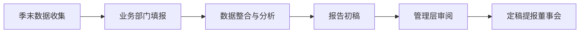

# 总裁报告 MOC

> [!abstract] 概述
> 2026年度总裁工作报告专区，按季度编制，服务于董事会汇报。报告围绕"增收/减支/固本/培元"四大战略主题，跟踪19项公司方针执行进展、经营指标达成、风险预警及管理层决策。

## 报告总览

| 季度 | 报告 | 覆盖期 | 状态 | 董事会日期 |
|------|------|--------|------|-----------|
| Q1 | [[2026年Q1总裁工作报告]] | 2026年1-3月 | ==编制中== | 待定 |
| Q2 | [[2026年Q2总裁工作报告]] | 2026年4-6月 | 待编制 | 待定 |
| Q3 | [[2026年Q3总裁工作报告]] | 2026年7-9月 | 待编制 | 待定 |
| Q4 | [[2026年Q4总裁工作报告]] | 2026年10-12月 | 待编制 | 待定 |

## 报告结构标准

每份季度总裁报告统一采用以下六章结构：

```
一、经营要点          ← 核心数字速览 + 亮点/挑战
二、业务运营          ← 整体表现 + 分业务线 + 全年预测
三、战略举措进展      ← 增收/减支/固本/培元四大主题
四、绩效合同执行概览  ← v3.0双轨KPI体系 + 季度评分
五、风险预警与应对    ← P0/P1/P2分级 + 应对措施
六、下季度重点工作    ← 里程碑 + 决策事项
附录                  ← 控股领导指示追踪 + 补充数据
```

## 编制流程



## 数据来源

| 数据类型 | 来源笔记 | 更新频率 |
|----------|----------|----------|
| 经营指标 | [[Q1经营指标]] | 季度 |
| E项目改善 | [[E项目改善跟踪]] | 月度 |
| 战略目标 | [[总经理要求与战略目标]] | 年度 |
| 19项方针 | [[2026年公司方针总览]] | 年度 |
| 中长期规划 | [[中长期战略规划（2026-2029）]] | 年度 |
| 绩效体系 | [[考评体系与绩效合同]] | 季度 |
| 会议决议 | 会议纪要目录 | 按会议 |

## 关键指标追踪

| 指标 | 年度目标 | Q1 | Q2 | Q3 | Q4 |
|------|---------|-----|-----|-----|-----|
| 营业收入 | 预算目标 | 达成61% | — | — | — |
| 净利润 | 预算目标 | -517万 | — | — | — |
| 新签订单 | 20,000台 | 6,846台 | — | — | — |
| 市占率 | ≥50% | 待统计 | — | — | — |
| E项目降本 | ¥1,200万 | 推进中 | — | — | — |
| 数字化覆盖率 | 100% | 规划完成 | — | — | — |

## 参考文件

| 文件 | 位置 | 说明 |
|------|------|------|
| 25年总裁报告 | `Desktop/25年度总裁报告/2025年度总裁工作报告2026_0316v3.pptx` | 结构与风格参考 |
| 工作底表 | `Desktop/26年工作文件/绩效考核/2026年绩效考核工作底表.xlsx` | 绩效数据源 |

## 相关链接

- [[26年工作区 MOC|← 返回工作区]]
- [[考评体系与绩效合同]] — 绩效合同执行板块数据源
- [[2026年公司方针总览]] — 19项方针执行追踪
- [[总经理要求与战略目标]] — 战略方向与年度目标
