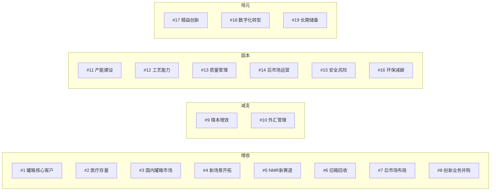

# 2026年公司方针总览

> [!abstract] 概述
> 中集环科2026年度19项公司方针，按**增收→减支→固本→培元**四大类组织，每项方针含衡量指标、责任人和核心举措数量。

## 方针全景

## 增收类方针（#1~#8）

### #1 巩固罐箱核心客户市场份额

| 维度 | 内容 |
|------|------|
| **类型** | 渗透率提升 |
| **衡量指标** | 订单份额 > 60%（核心客户 > 70%） |
| **核心举措** | 7项 |
| **责任人** | 谭彦杰、刘建中、陈晓春、杨殿伟、黄红如、包秋婧、张毅 |

核心举措：
1. 化工行业趋势预判报告（5月）→ 修订订单决策机制
2. ==策略采购降本10%==（钢厂合作、阀门国产化、E项目突破）
3. 设计/工艺优化降低物料用量与制造成本10%
4. 报价流程优化，准确率 > 95%
5. 客户投诉联动响应（临时<1天、解决<7天）
6. ==材料备库 + 成品预投==（标罐7天、非标45天交期）
7. 融资工具创新，"内借外用"金融赋能

### #2 稳步提升医疗存量业务市场份额

| 维度 | 内容 |
|------|------|
| **衡量指标** | 存量核磁业务销售收入累计 ≥ ==2.7亿== |
| **核心举措** | 2项 |
| **责任人** | 朱元春 |

核心举措：
1. 核心客户（西门子/联影/飞利浦）新型号开发 → 份额提升10%
2. 新客户拓展 ≥ 2家，样品交付及时率 ≥ 98%

### #3 国内罐箱市场开拓

| 维度 | 内容 |
|------|------|
| **衡量指标** | 市场份额 > 50% |
| **核心举措** | 3项 |
| **责任人** | 包秋婧、陈晓春 |

核心举措：
1. 分类营销策略 + 激励机制
2. 终端客户场景解决方案转型
3. 产品标准化、模块化（选用率50%）

### #4 开拓新场景领域

| 维度 | 内容 |
|------|------|
| **衡量指标** | 新场景落地累计 > 2个 |
| **核心举措** | 3项 |
| **责任人** | 包秋婧、陈晓春 |

### #5 核磁以外新领域（NMR）

| 维度 | 内容 |
|------|------|
| **衡量指标** | 新业务销售额累计 ≥ 1,000万 |
| **责任人** | 朱元春 |

### #6 旧箱回收再利用

| 维度 | 内容 |
|------|------|
| **衡量指标** | （回收+新购）销售累计 > 1,000台 |
| **责任人** | 杨殿伟、包秋婧、周青 |

### #7 后市场布局开拓

| 维度 | 内容 |
|------|------|
| **核心举措** | 南京堆场整合、连云港扭亏、全球售后网络 |
| **责任人** | 刘建中 |

### #8 创新业务培育

| 维度 | 内容 |
|------|------|
| **衡量指标** | 7月实现并表，年内并表利润 > 3,000万 |
| **责任人** | 谭彦杰 |

## 减支类方针（#9~#10）

### #9 降本增效

| 维度 | 内容 |
|------|------|
| **衡量指标** | 人效提升10% |
| **核心举措** | 生产自动化 + 工时薪酬解耦 + AI知识管理 + 编制优化 |
| **责任人** | 林爱彬、张毅 |

### #10 外汇与金融管理

| 维度 | 内容 |
|------|------|
| **核心举措** | 推动人民币合同、远期套保、外汇期权 |
| **责任人** | 张毅、包秋婧 |

## 固本类方针（#11~#16）

### #11 产能建设

| 项目 | 目标 | 责任人 |
|------|------|--------|
| 高端医疗一期 | 年底厂房主体 + 设备进场 | 朱元春 |
| 特罐一期搬迁 | 27年初搬迁完成 | 杨殿伟 |
| 英国SMT建厂 | 年底试生产 | 朱元春 |

### #12 工艺能力

- 工艺机制流程变革，强化技术-生产桥梁
- 结构化工艺平台、标准化、自动化、数字化

### #13 全面质量管理

- 全价值链质量改进（李世社）

### #14 后市场运营能力

- 撬装式清洗/水处理装置（杨殿伟、刘建中）

### #15~#16 HSE与环保

- 双重预防机制 + AI监测预警
- 节能减碳 + "三废"全生命周期管控

## 培元类方针（#17~#19）

### #17 精益创新

| 维度 | 内容 |
|------|------|
| **衡量指标** | 特罐模块化覆盖率20%、新产品 > 5项 |
| **核心举措** | STP标准化、新产品路线图、供应商协同创新 |
| **责任人** | 陈晓春、刘建中 |

### #18 智改数转（==数字化转型==）

> [!tip] 王瑞俊负责
> 这是用户本人直接负责的方针领域。

| 维度 | 内容 |
|------|------|
| **衡量指标** | ==业务信息化覆盖率100%== |
| **核心举措** | 3项 |
| **责任人** | ==王瑞俊== |

1. 搭建结构化工艺平台、IoT工业互联网、后市场ERP、QMS质量系统、DR探伤系统
2. 数字化转型蓝图 → 决策融合场景开发
3. 公司级定向数据治理

### #19 长期能力储备

| 维度 | 内容 |
|------|------|
| **核心举措** | 搜寻创新业务课题，形成新增长点 |
| **责任人** | 谭彦杰 |

## 关键决策点

> [!warning] 需关注
> 1. 增收8项方针中，罐箱业务承压最大（缺口11.5亿），需密切跟踪签单与排产
> 2. #18数字化方针（王瑞俊负责）是多项方针的使能基础（工艺平台→#12，IoT→#15，数据治理→#4报价）
> 3. E项目是多条降本路径的交汇点（采购/设计/工艺）

## 相关链接

- [[总经理要求与战略目标]] — 战略顶层设计
- [[增收—渗透率提升]] — #1~#2 详细行动计划
- [[增收—新市场新领域]] — #3~#5 详细行动计划
- [[培元—创新与数字化]] — ==#17~#19 详细行动计划==
- [[26年工作区 MOC|← 返回工作区]]
