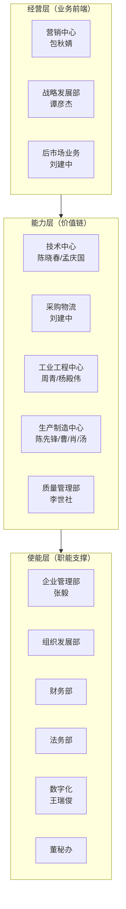

# 组织架构与职责

> [!abstract] 概述
> 中集环科化工装备事业部2026年三层组织架构及核心人员-职责映射。

## 三层架构

## 核心人员-职责映射

| 姓名 | 职能 | 承接方针 | 核心KPI |
|------|------|----------|---------|
| **季国祥** | 总经理 | 全局 | 营收/利润/市值 |
| **包秋婧** | 营销中心 | #1#3#4#6 | 新签2万台、市占≥50%、毛利率≥9.43% |
| **谭彦杰** | 战略发展 | #1#8#19 | 行研报告、并购并表、创新课题 |
| **刘建中** | 采购物流/后市场 | #1#6#7#17 | ==采购降本10%==、后市场运营 |
| **陈晓春** | 技术中心 | #1#3#4#12#17 | 设计降本、模块化覆盖率20%、新品>5项 |
| **杨殿伟** | 工业工程/特罐 | #1#6#11#12#14 | 特罐搬迁、工艺标准化 |
| **朱元春** | 医疗事业部 | #2#5#11 | 年销售2.5亿、核心客户份额+10% |
| **林爱彬** | 生产/HSE | #9#15#16 | 人效+10%、安全风险防控 |
| **张毅** | 企业管理 | #9#10 | 编制管控、外汇管理 |
| **==王瑞俊==** | ==数字化== | ==#18== | ==信息化覆盖率100%、数字化蓝图== |
| **黄红如** | 报价管理 | #1 | 报价准确率>95% |
| **李世社** | 质量管理 | #13 | 全价值链质量改进 |

## 26年核心能力强化重点

| 能力域 | 强化方向 | 主责 |
|--------|----------|------|
| 大客户管理 | 分类营销策略、CRM台账 | 包秋婧 |
| 市场导向研发 | STP设计改善、新产品路线图 | 陈晓春 |
| 策略采购 | 钢厂合作、阀门国产化、E项目 | 刘建中 |
| 工艺界面管理 | 技术-生产桥梁、前置管理 | 杨殿伟 |
| 标准化/信息化/自动化 | 结构化工艺、IoT、QMS | ==王瑞俊== |

## 医疗事业部（独立经营体）

| KPI | 目标 |
|-----|------|
| 年销售 | ≥ 2.5亿 |
| 逾期款 | ≤ 2% |
| 关键工序合格率 | 100% |
| 新型号准入 | ≥ 2个 |
| 新客户拓展 | ≥ 2家 |

## 关键决策点

> [!warning] 需关注
> 1. 刘建中同时承担采购和后市场两条线，工作负荷较重
> 2. 王瑞俊（用户）的数字化工作是多条方针的使能基础
> 3. 编制冻结背景下，内部转岗和AI提效成为必选项

## 相关链接

- [[2026年公司方针总览]] — 19项方针与责任人对应
- [[考评体系与绩效合同]] — 考核机制
- [[26年工作区 MOC|← 返回工作区]]
