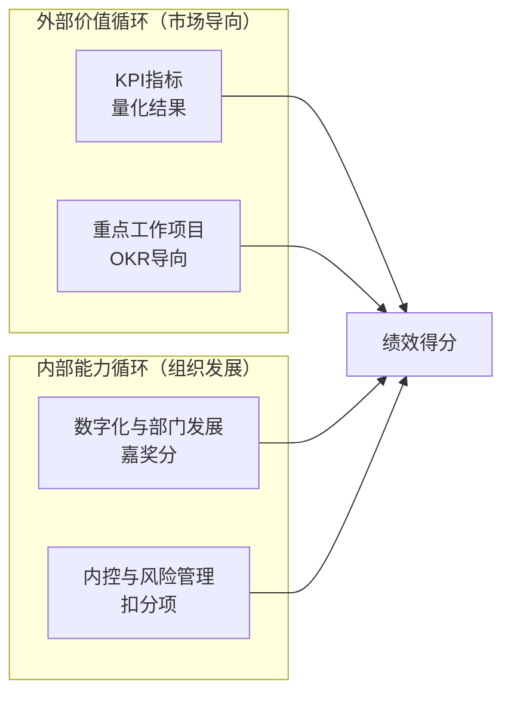

# 考评体系与绩效合同

> [!abstract] 概述
> 2026年部门业绩合同设置思路，采用"外部价值循环 + 内部能力循环"双循环模型，覆盖18个考核实体。

## 考评框架

## 四维考核结构

| 维度 | 性质 | 说明 |
|------|------|------|
| **KPI指标** | 量化结果 | 营收/利润/市占率/CCC等硬指标 |
| **重点工作项目** | OKR导向 | 对应19项方针的落地执行 |
| **数字化与部门发展** | ==嘉奖分== | 数字化推进、创新项目、能力建设加分 |
| **内控与风险管理** | ==扣分项== | 合规/安全/质量事故扣分 |

## 核心KPI承接关系

| 公司级KPI | 主要承接部门 | 相关支撑部门 |
|-----------|-------------|-------------|
| **营收** | 营销中心（新签订单）、后市场/智能/医疗（P&L） | 技术中心（新品销售占比） |
| **利润** | 后市场/智能/医疗（P&L） | ==采购部（策略采购、E计划）==、技术（用量降低）、工业工程（工艺优化）、生产（制造费用） |
| **市占率** | 营销中心 | — |
| **市值** | 董秘办 | 战略发展部 |
| **CCC** | 企管部（存货周转）、==采购部（原材料周转）== | 营销中心（账款管理） |

## 能力建设考核

| 能力域 | 主承接 | 支撑部门 |
|--------|--------|----------|
| 生产能力 | 工业工程（特罐搬迁）、医疗（建厂） | 绩效/财务/企管 |
| 营销能力 | 营销中心（国内体系搭建） | 组织发展 |
| 创新能力 | 技术中心（新品路线图）、采购（供应链创新） | 战略发展 |
| 精益能力 | 技术（标准化/模块化）、工业工程（智能制造） | 企管（精益成熟度） |
| ==数字化能力== | ==工业工程（工艺/IoT）、质量（QMS）、后市场（ERP）== | ==企管（数据治理）== |
| 组织能力 | 组织发展（干部轮岗） | — |
| 投并购能力 | 战略发展 | 组织发展（人才）、企管（知识管理） |

## 营销中心年度KPI

| 指标 | 目标 |
|------|------|
| 新签订单 | ==2万台== |
| 毛利率 | ≥ 9.43% |
| 外销封头 | 6,000万 |
| 市占率 | ≥ 50% |

## 考核周期

- **季度**：重点工作项目进度点检
- **半年度**：KPI中期回顾
- **年度**：绩效合同综合评定
- 月度经营会议同步复盘

## 关键决策点

> [!warning] 需关注
> 1. 罐箱业务无直接利润承接部门，利润由采购/技术/工业工程/生产各自承接——需跨部门协同
> 2. 数字化与部门发展作为"嘉奖分"，是推动数字化落地的正向激励
> 3. 18个考核实体覆盖全公司，模板中部分KPI数据尚未填写

## 相关链接

- [[组织架构与职责]] — 部门-负责人映射
- [[2026年公司方针总览]] — 方针与KPI的对应关系
- [[26年工作区 MOC|← 返回工作区]]
