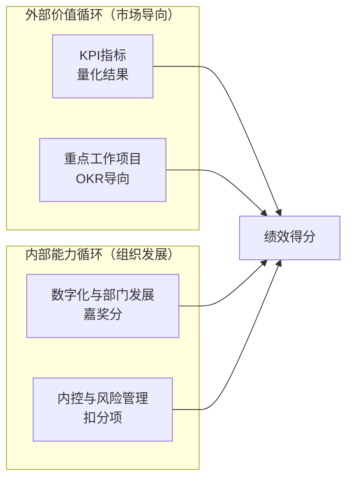

# 考评体系与绩效合同

> [!abstract] 概述
> 2026年部门业绩合同设置思路，采用"外部价值循环 + 内部能力循环"双循环模型，覆盖18个考核实体。

## 考评框架

## 四维考核结构（MECE重构版 v2.0）

| 维度 | 性质 | 说明 | MECE归属原则 |
|------|------|------|-------------|
| **KPI指标** | 量化结果 | 营收/利润/市占率/CCC/效率终值/质量终值 | 期末可直接取数的What——衡量终态 |
| **重点工作项目** | OKR导向 | 对应19项方针的项目/举措/能力建设 | 需推动的How——推动过程 |
| **数字化与部门发展** | ==嘉奖分== | 数字化推进、创新项目、能力建设加分 | AI嵌入OKR中考核"AI带来了什么"而非独立设项 |
| **内控与风险管理** | ==扣分项== | 合规/安全/质量事故扣分 | — |

> [!tip] MECE分割规则
> 每个考核项仅归属KPI或OKR其中一类，不重复。如一个指标既有结果性又有过程性，按本质属性归类：终态数值→KPI；建设项目/改善路径→OKR。详见《2026年绩效考核优化方案_领导建议修订版 v2.0》第四章。

## 核心KPI承接关系

| 公司级KPI | 主要承接部门 | 相关支撑部门 |
|-----------|-------------|-------------|
| **营收** | 营销中心（新签订单）、后市场/智能/医疗（P&L） | 技术中心（新品销售占比） |
| **利润** | 后市场/智能/医疗（P&L） | ==采购部（策略采购、E计划）==、技术（用量降低）、工业工程（工艺优化）、生产（制造费用） |
| **市占率** | 营销中心 | — |
| **市值** | 董秘办 | 战略发展部 |
| **CCC** | 企管部（存货周转）、==采购部（原材料周转）== | 营销中心（账款管理） |

## 能力建设考核

| 能力域       | 主承接                               | 支撑部门              |
| --------- | --------------------------------- | ----------------- |
| 生产能力      | 工业工程（特罐搬迁）、医疗（建厂）                 | 绩效/财务/企管          |
| 营销能力      | 营销中心（国内体系搭建）                      | 组织发展              |
| 创新能力      | 技术中心（新品路线图）、采购（供应链创新）             | 战略发展              |
| 精益能力      | 技术（标准化/模块化）、工业工程（智能制造）            | 企管（精益成熟度）         |
| ==数字化能力== | ==工业工程（工艺/IoT）、质量（QMS）、后市场（ERP）== | ==企管（数据治理）==      |
| 组织能力      | 组织发展（干部轮岗）                        | —                 |
| 投并购能力     | 战略发展                              | 组织发展（人才）、企管（知识管理） |

## 营销中心年度KPI

| 指标 | 目标 |
|------|------|
| 新签订单 | ==2万台== |
| 毛利率 | ≥ 9.43% |
| 外销封头 | 6,000万 |
| 市占率 | ≥ 50% |

## 考核周期

- **季度**：重点工作项目进度点检
- **半年度**：KPI中期回顾
- **年度**：绩效合同综合评定
- 月度经营会议同步复盘

## 关键决策点

> [!warning] 需关注
> 1. 罐箱业务无直接利润承接部门，利润由采购/技术/工业工程/生产各自承接——需跨部门协同
> 2. 数字化与部门发展作为"嘉奖分"，是推动数字化落地的正向激励
> 3. 18个考核实体覆盖全公司，工作底表已含30个sheet（含汇总看板+评分标准说明）
> 4. **v2.0 MECE重构（2026.4.6）**：KPI与OKR已按MECE原则重新分割，消除8项重复指标；AI考核嵌入各部门OKR而非独立设项
> 5. **技术中心**以"研发投入→商业产出"闭环为导向，**工业工程**以ETO工艺枢纽（前连设计/后连市场）为导向
> 6. **权重结构**：KPI核心业务指标50% + OKR重点工作项目30% + 能力突破与发展10% + 底线与合规10% = 100分
> 7. **分层管理（2026.4.7）**：总部职能与事业部职能体现分层——总部管"全公司政策/合并口径/标准督导"，事业部管"化工板块承接落地/执行"。分拆第一年保留适度关联，用措辞区分层级

## 总部-事业部分层管理对照

> [!info] 分拆第一年原则
> 总部 = 政策制定 + 全公司统筹 + 合并视角；事业部 = 承接落地 + 化工板块执行。不宜过度切割，保留适度关联。

| 职能域 | 总部（覆盖全事业部） | 事业部（仅化工装备板块） | 分层要点 |
|--------|---------------------|------------------------|---------|
| **人力资源** | 组织发展部 | 人事行政部 | 总部管全公司战略岗位/继任/政策制定；事业部承接落地+日常招聘/培训执行 |
| **经营管理** | 企业管理部 | 绩效管理部 | 总部管合并口径经营指标/≥500万投后评价/标准建设；事业部管化工板块报价/交付/≥100万投后评价 |
| **财务管理** | 财务管理部 | 财务部（化工装备） | 总部管合并报表/资金集中/融资/费控政策；事业部管化工板块费用率/预测/预算/账款 |

## MECE合规：重复项消解总表（v2.0 已落地工作底表）

| 原重复项          | 归属KPI        | 归属OKR            | 裁决理由                 |
| ------------- | ------------ | ---------------- | -------------------- |
| 新产品销售收入占比     | 技术中心K2（终值）   | O4（pipeline过程管理） | 终态财务结果归KPI           |
| 物料用量降低10%     | 技术K3（设计损耗率）  | 技术O3+工业工程O4      | 拆为结果和路径，按可控性分属两部门    |
| 特罐模块化覆盖率      | —            | 技术O1（建设项目）       | 本质是能力建设项目，非期末可取数结果   |
| 标准工时下降≥10%    | 工业工程K1（达成率）  | 工业工程O1（优化项目）     | 拆为执行结果和改善路径          |
| 材料利用率         | 工业工程K2（终值）   | 工业工程O4（提升专项）     | 终值留KPI，路径归OKR        |
| 采购降本10%       | 采购K3（终值）     | 采购O2（供应商优化路径）    | 终态留KPI，实现路径归OKR      |
| 人均产量提升10%     | 生产K3（终值）     | 生产O1（精益改善项目）     | 终态留KPI，举措归OKR        |
| 万元人工成本产出      | 已删除（与人均产量重复） | —                | 同一件事不分两个项目考核         |
| AI应用≥N项       | —            | 嵌入各部门相关OKR       | 考核"AI带来了什么"而非"用了AI"  |
| 战略发展部OKR×5    | KPI保留4项终态    | OKR改为3项制度建设      | 原OKR与KPI 1:1复述，已消除   |
| 董秘办市值响应时效     | —            | OKR1（三级响应机制建立）   | 机制建设归OKR，KPI只考核区间维持率 |
| 企管部信息化/数字化    | —            | OKR1-6（建设项目）     | 本质是建设项目，非期末可直取的数字    |
| 绩效管理部基建       | —            | OKR3（特罐一期完工）     | 基建是项目，归OKR           |
| 人事行政部末位优化/加班费 | —            | OKR1/OKR3（治理举措）  | KPI人效只保留人均净利         |

## 工作底表与文件

| 文件 | 位置 | 说明 |
|------|------|------|
| 工作底表 | `Desktop/26年工作文件/绩效考核/2026年绩效考核工作底表.xlsx` | 30个sheet，含汇总看板+28部门+评分标准 |
| 规则文档 | `Desktop/26年工作文件/绩效考核/知识库/考核制度与规则/` | MECE v2.0（2026.4.6） |
| 生成脚本 | `Desktop/26年工作文件/绩效考核/gen_scorecard.py` | Python openpyxl生成Excel |

## 相关链接

- [[组织架构与职责]] — 部门-负责人映射
- [[2026年公司方针总览]] — 方针与KPI的对应关系
- [[26年工作区 MOC|← 返回工作区]]
