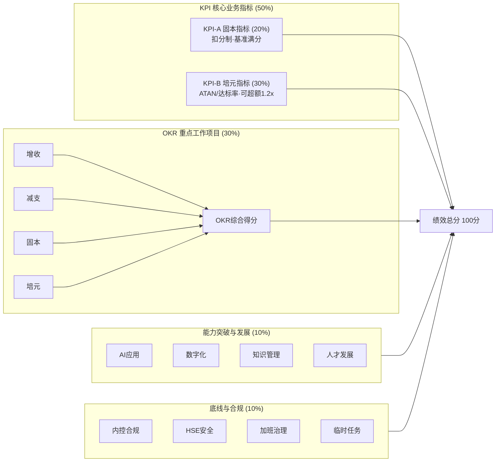

# 考评体系与绩效合同

> [!abstract] 概述
> 2026年部门业绩合同设置思路，采用"固本+培元"双轨KPI模型，覆盖28个考核实体（含汇总看板+评分标准说明共30个sheet）。v3.0（2026.4.9）引入KPI双轨制，区分维持性底线指标与变革增值指标的评价逻辑。

## 考评框架 v3.0

## 五维考核结构（v3.0 双轨制）

| 维度 | 权重 | 性质 | 评分逻辑 | 适用指标举例 |
|------|------|------|----------|-------------|
| **KPI-A 固本指标** | ==20%== | 职能维持性底线 | ==扣分制==：基准满分，出现问题扣分，不设超额奖励 | 安全/合规/信披/申报准确率/交付及时率(≥95%)/质量底线 |
| **KPI-B 培元指标** | ==30%== | 变革增值驱动 | ==ATAN/达标率==：可超额得分（上限1.2倍） | 降本率/人效提升/收入增长/研发NPV/供应链创新 |
| **OKR 重点工作项目** | 30% | 项目导向 | 里程碑+效果评审，每项10分制，加权平均折算 | 围绕增收/减支/固本/培元四大战略主题 |
| **能力突破与发展** | 10% | 嘉奖分 | AI应用/数字化/知识管理/人才发展 | — |
| **底线与合规** | 10% | 扣分项 | 基准10分，出问题即扣，扣完为止 | 内控/HSE/加班治理/临时任务 |

> [!tip] 固本 vs 培元的核心区别
> - **固本**（基础加固）：做好是本分，做不好要受罚。扣分制，无超额奖励。
> - **培元**（当前见效）：超额有激励，鼓励突破。ATAN法设上限1.2倍，避免过度博弈。

## OKR 战略主题分类

v3.0新增：每个OKR项目须标注战略主题，确保重点工作与公司战略方向对齐。

| 战略主题 | 含义 | 典型OKR |
|----------|------|---------|
| **增收** | 营收增长、市场拓展、新客户/新产品 | 预投模型、客户拓展、新品转化 |
| **减支** | 降本增效、费用管控、精益改善 | 精益降本、辅材降本、加班治理 |
| **固本** | 基础保障、质量安全、体系建设 | 来料合格率帮扶、ASME换证、融资响应 |
| **培元** | 创新变革、数字化、能力建设 | AI赋能、信息化建设、绿色工厂 |

## 核心KPI承接关系

| 公司级KPI | 主要承接部门 | 相关支撑部门 |
|-----------|-------------|-------------|
| **营收** | 营销中心（新签订单）、后市场/智能/医疗（P&L） | 技术中心（新品销售占比） |
| **利润** | 后市场/智能/医疗（P&L） | ==采购部（策略采购、E计划）==、技术（用量降低）、工业工程（工艺优化）、生产（制造费用） |
| **市占率** | 营销中心 | — |
| **市值** | 董秘办（ETF维持+三级响应） | 战略发展部 |
| **CCC** | 企管部（存货周转）、==采购部（原材料周转）== | 营销中心（账款管理） |

## 各部门 KPI 双轨分布总表

### 总部职能部门

| 部门 | 固本KPI（扣分制） | 培元KPI（ATAN/达标率） |
|------|-------------------|----------------------|
| **战略发展部** | — | 行研报告采纳率(15)、并表利润(15)、立题质量(10)、业务拆分(10) |
| **董秘办** | ETF维持(5)、信披及时率(10)、投资者沟通(10) | 超额收益及区间维持(10)、ESG评级(10) |
| **企业管理部** | 重大投资投后评价(10) | 商业计划执行率(15)、精益降本(15)、存货周转(10) |
| **组织发展部** | 继任准备度(10)、轮岗胜任率(10)、核心离职率(5) | 战略岗位到岗率(15)、培训ROI(10) |
| **财务管理部** | 报表准确率(8)、时效(7)、资金集中(8)、汇率管理(7)、融资丢单(5) | 合并预测(10) |

### 事业部

| 部门 | 固本KPI | 培元KPI |
|------|---------|---------|
| **化工装备事业部** | 逾期款(5)、工序合格率(5) | 营收(15)、净利(15)、存货周转(5)、人效(5) |
| **医疗装备事业部** | 逾期款(5)、工序合格率(5) | 营收(15)、净利(15)、存货周转(5)、能耗(5) |

### 一级部门（化工装备）

| 部门 | 固本KPI（扣分制） | 培元KPI（ATAN/达标率） |
|------|-------------------|----------------------|
| **营销中心** | 逾期款(5) | 新签订单(10)、毛利率(10)、封头收入(5)、市占率(5)、新客户(10) |
| **技术中心** | 研发节点完成率(10)、专利(7) | 新品转化(15)、==研发NPV==(10)、设计损耗(8) |
| **工业工程中心** | 项目完成率(10)、报价及时率(10)、内审整改(5) | ==标准工时同比下降==(10)、材料利用率(10)、能耗(5) |
| **采购部** | ==来料合格率==(5)、==材料质量损失率==(5)、到货及时率(8) | ==报价响应==(5)、降本率(10)、周转天数(7)、人效(5)、==供应链创新==(5) |
| **物流仓储部** | ==交付及时率==(5)、==申报准确率==(5)、==运输成本==(5)、配送及时率(5)、货损(5)、单证(5) | 班轮综合指标(5)、==渠道竞争力==(5)、人效(5) |
| **标罐生产部** | 工序合格率(10)、HSE(5) | 能耗(5)、人均产量(12)、==生产效率(与工艺挂钩)==(10)、危废(8) |
| **特罐生产部** | 工序合格率(10)、HSE(5) | 能耗(5)、人均产量(12)、==特罐熟练程度提升==(10)、危废(8) |
| **配套部** | 配套合格率(8)、HSE(5)、==材料利用率与废料聚合==(8)、==库存材料整体利用率==(5) | 能耗(5)、工时利用率(5)、人均产量(9) |
| **HSE部** | 隐患整改率(10)、内审整改(5)、事故数(10) | 风险消除(10)、危废排放(10) |
| **质量管理部** | 出库合格率(8)、出厂合格率(8)、内审整改(5) | 内部质量损失(8)、追溯覆盖率(5)、==CTQ达标率==(8) |
| **财务部** | 预算偏差(5)、审计差异(5)、应付周转(5)、==汇兑损益==(5) | 费用率(8)、预测差异(8)、应收周转(5)、==存款收益==(5) |
| **绩效管理部** | 报价响应(10)、交付周期(13)、投后评价(7)、交办关闭(10) | ==最优排产达成率==(10) |
| **人事行政部** | 招聘完成率(8)、骨干流动率(8)、培训实施率(5)、==劳动纠纷数==(5) | 自主招工占比(5)、人均净利(12) |
| **后市场业务** | — | 营收(15)、净利(15)、人效(10) |
| **智能业务** | ==逾期款(含国内分层)==(8)、投诉率(8) | 营收(12)、净利(12)、人均创收(5) |

> [!info] ==标记== 为v3.0新增或重大修改的指标

## v3.0 领导第二轮批示要点

### 全局要求
- 日常工作中加大AI工具应用，提升效率
- 固定工作时间内产出要有衡量，加班要有加班绩效，==消除政治性加班==
- 增加偶发性事情（临时性任务）完成率——Logistic Regression评价
- 人工费用与投资有关，==不能只讲机效不讲人效==
- 部门费用须明确变动费用与固定费用划分
- 重点工作与KPI之间须有关联性，围绕增收/减支/固本/培元设置
- 目标、实现路径要明确

### 部门特别批示

| 部门 | 关键批示 |
|------|----------|
| 战略发展部 | 行研报告须含变量/经济性/性能/便利性；立题须有质量不能只出量 |
| 董秘办 | 市值须维持在ETF里(95-105亿)；连续一周低位须有响应机制；信披不能有瑕疵 |
| 企业管理部 | 信息化要看得见/可视化；数字化总体规划+AI培训+企业智能体；知识管理收集隐性知识 |
| 组织发展部 | 考核指标须和所需结果有直接关系；基于战略需要哪些人才及市场价 |
| 财务管理部 | ==融资不能丢单==；多业务独立核算短期完成 |
| 医疗事业部 | 销售收入可考虑每年提升5% |
| 营销中心 | 封头产能影响销售须量化；产品预投公式T×Q×P≤S |
| 采购部 | 齐套率基于精益思想缩短Leadtime；报价响应标准品≤8h；供应链创新侧重增值 |
| 技术中心 | 自主研发须先了解市场需求；梳理高价值研发项目；R&D Reward NPV>0 |
| 物流仓储部 | 班轮综合考虑时间+价格；申报准确率出现就扣分；涉美保税料件信息化 |
| 工业工程中心 | 标准工时三者统一(预算/成本核算/薪酬)；SPA-H 85%太低须上调 |
| 生产部(标罐) | 生产效率与工艺挂钩；改进产线规划/工艺/设备 |
| 生产部(特罐) | 提高熟练程度 |
| 配套部 | 材料利用率+废料聚合不满足就扣分；车间不产生废料；摸清余废料现有量/新增量/消耗目标 |
| HSE部 | 绿色工厂建设 |
| 财务部 | 新增存款收益+汇率指标 |
| 人事行政部 | 员工劳动纠纷；企业绩效函数(人/机/料) |
| 绩效管理部 | 排产须满足客户需求+效率最大化+公司利益最大化 |
| 质量管理部 | 关键质量特性CTQ |
| 智能业务 | 逾期款增加国内业务维度，分层(1个月+/3个月+) |

## 评分方法体系

| 方法 | 公式/逻辑 | 适用场景 |
|------|-----------|----------|
| **ATAN法** | 得分=(1+ATAN(实际/目标-1))×权重，上限1.2倍 | 培元型KPI（可超额） |
| **扣分制** | 基准满分，触发扣分条件即扣 | 固本型KPI（底线守护） |
| **达标率法** | 得分=(实际/目标)×权重，线性 | 培元型KPI（线性达标） |
| **Logistic Regression** | P=sigmoid(w₁x₁+w₂x₂+...); P≥0.6合格 | 定性工作离散评价 |
| **效果对比法** | (改善后-改善前)/改善前 | OKR项目成效 |
| **里程碑验收法** | 按节点逐项验收 | OKR建设类项目 |
| **NPV法** | R&D Reward = -IP + Cashflow + F > 0 | 研发项目回报评价 |

## 能力建设考核

| 能力域       | 主承接                               | 支撑部门              |
| --------- | --------------------------------- | ----------------- |
| 生产能力      | 工业工程（特罐搬迁）、医疗（建厂）                 | 绩效/财务/企管          |
| 营销能力      | 营销中心（国内体系搭建）                      | 组织发展              |
| 创新能力      | 技术中心（新品路线图）、采购（供应链创新）             | 战略发展              |
| 精益能力      | 技术（标准化/模块化）、工业工程（智能制造）            | 企管（精益成熟度）         |
| ==数字化能力== | ==工业工程（工艺/IoT）、质量（QMS）、后市场（ERP）== | ==企管（数据治理）==      |
| 组织能力      | 组织发展（干部轮岗）                        | —                 |
| 投并购能力     | 战略发展                              | 组织发展（人才）、企管（知识管理） |

## 营销中心年度KPI

| 指标 | 目标 |
|------|------|
| 新签订单 | ==2万台== |
| 毛利率 | ≥ 10% |
| 外销封头 | 6,000万 |
| 市占率 | ≥ 50% |
| 新客户签单 | 4.3亿(国内1.5亿) |

## 总部-事业部分层管理对照

> [!info] 分拆第一年原则
> 总部 = 政策制定 + 全公司统筹 + 合并视角；事业部 = 承接落地 + 化工板块执行。不宜过度切割，保留适度关联。

| 职能域 | 总部（覆盖全事业部） | 事业部（仅化工装备板块） | 分层要点 |
|--------|---------------------|------------------------|---------|
| **人力资源** | 组织发展部 | 人事行政部 | 总部管全公司战略岗位/继任/政策制定；事业部承接落地+日常招聘/培训执行 |
| **经营管理** | 企业管理部 | 绩效管理部 | 总部管合并口径经营指标/≥500万投后评价/标准建设；事业部管化工板块报价/交付/≥100万投后评价 |
| **财务管理** | 财务管理部 | 财务部（化工装备） | 总部管合并报表/资金集中/融资/费控政策；事业部管化工板块费用率/预测/预算/账款 |

## 考核周期

- **季度**：重点工作项目进度点检 + KPI季度评分
- **半年度**：KPI中期回顾
- **年度**：绩效合同综合评定
- 月度经营会议同步复盘

## MECE合规：重复项消解总表（v2.0 已落地工作底表）

| 原重复项          | 归属KPI        | 归属OKR            | 裁决理由                 |
| ------------- | ------------ | ---------------- | -------------------- |
| 新产品销售收入占比     | 技术中心K2（终值）   | O4（pipeline过程管理） | 终态财务结果归KPI           |
| 物料用量降低10%     | 技术K3（设计损耗率）  | 技术O3+工业工程O4      | 拆为结果和路径，按可控性分属两部门    |
| 特罐模块化覆盖率      | —            | 技术O1（建设项目）       | 本质是能力建设项目，非期末可取数结果   |
| 标准工时下降≥10%    | 工业工程K1（达成率）  | 工业工程O1（优化项目）     | 拆为执行结果和改善路径          |
| 材料利用率         | 工业工程K2（终值）   | 工业工程O4（提升专项）     | 终值留KPI，路径归OKR        |
| 采购降本10%       | 采购K3（终值）     | 采购O2（供应商优化路径）    | 终态留KPI，实现路径归OKR      |
| 人均产量提升10%     | 生产K3（终值）     | 生产O1（精益改善项目）     | 终态留KPI，举措归OKR        |
| 万元人工成本产出      | 已删除（与人均产量重复） | —                | 同一件事不分两个项目考核         |
| AI应用≥N项       | —            | 嵌入各部门相关OKR       | 考核"AI带来了什么"而非"用了AI"  |

## 工作底表与文件

| 文件 | 位置 | 说明 |
|------|------|------|
| 工作底表 | `Desktop/26年工作文件/绩效考核/2026年绩效考核工作底表.xlsx` | 30个sheet，含汇总看板+28部门+评分标准 |
| 生成脚本 | `Desktop/26年工作文件/绩效考核/gen_scorecard.py` | ==v3.0== Python openpyxl，KPI双轨制+领导第二轮批示 |
| 规则文档 | `Desktop/26年工作文件/绩效考核/知识库/考核制度与规则/` | MECE v2.0（2026.4.6） |
| 领导批示 | `Desktop/26年工作文件/绩效考核/知识库/领导批示与建议/改善建议.txt` | 两轮批示汇总 |

## 关键决策点

> [!warning] 需关注
> 1. ==v3.0 双轨制（2026.4.9）==：KPI拆分为固本(20%扣分制) + 培元(30%ATAN/达标率)，区分维持性底线与变革增值
> 2. ==OKR战略主题标注==：每个OKR须标注增收/减支/固本/培元，确保重点工作与战略方向对齐
> 3. 罐箱业务无直接利润承接部门，利润由采购/技术/工业工程/生产各自承接——需跨部门协同
> 4. 数字化与部门发展作为Part 3"能力突破"，是推动数字化落地的正向激励
> 5. 28个考核实体覆盖全公司，工作底表含30个sheet（含汇总看板+评分标准说明）
> 6. v2.0 MECE重构（2026.4.6）：KPI与OKR已按MECE原则重新分割，消除8项重复指标
> 7. **分层管理（2026.4.7）**：总部职能与事业部职能分层——总部管"全公司政策/合并口径/标准督导"，事业部管"化工板块承接落地/执行"
> 8. ==部门费用结构==：每个部门须明确变动费用与固定费用占比
> 9. ==Logistic Regression==用于定性工作的离散评价（偶发性任务完成率等）

## 版本历程

| 版本 | 日期 | 变更内容 |
|------|------|----------|
| v1.0 | 2026.3 | 初版四维考核结构（KPI50%+OKR30%+嘉奖10%+扣分10%） |
| v2.0 | 2026.4.6 | MECE重构，消除8项KPI/OKR重复；AI嵌入OKR |
| v2.1 | 2026.4.7 | 总部-事业部分层管理 |
| ==v3.0== | ==2026.4.9== | ==KPI双轨制(固本20%+培元30%)；领导第二轮批示全量落地；OKR战略主题标注；28部门指标增补/调整== |

## 相关链接

- [[组织架构与职责]] — 部门-负责人映射
- [[2026年公司方针总览]] — 方针与KPI的对应关系
- [[减支—成本领先]] — 采购降本/精益/人效相关
- [[固本—制造与HSE]] — 生产质量/安全/工艺相关
- [[培元—创新与数字化]] — 数字化/AI/创新相关
- [[26年工作区 MOC|← 返回工作区]]
