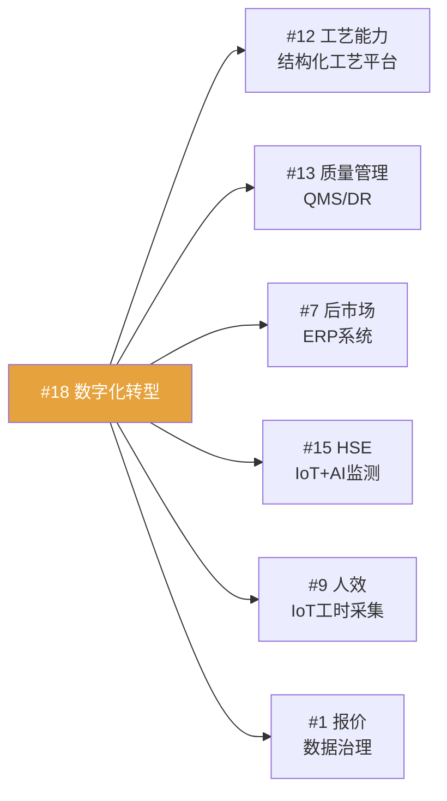

# 培元—创新与数字化

> [!abstract] 概述
> 方针#17（精益创新）+ ==方针#18（智改数转，王瑞俊主责）== + 方针#19（长期储备），共7项核心举措。#18是用户直接负责的核心方针。

## 方针#17：精益创新

### 举措1：STP设计源头改善（陈晓春）

| 维度 | 目标 |
|------|------|
| 衡量指标 | 特罐模块化覆盖率 ==0% → 20%== |

**STP方法论：** 分类（Segmentation）→ 聚焦（Targeting）→ 定位（Positioning）

**里程碑：**
- [ ] 【4月】确定2-3种重点特种产品，启动模块化开发
- [ ] 【6-10月】完成重点产品模块化开发工作的70%
- [ ] 【7月30日】启动模块化选配应用，建立覆盖率跟踪机制
- [ ] 【12月】复盘，固化成果

### 举措2：新产品开发路线图（陈晓春）

| 维度 | 目标 |
|------|------|
| 衡量指标 | 新产品开发数量累计 > ==5项== |

| 产品 | 预计完成时间 |
|------|-------------|
| 核聚变氦气罐 | 【3月】✅ |
| 新一代ISO罐箱 | 【6月】 |
| 浓硫酸铁路罐箱 | 【9月】 |
| 聚氨酯清洗剂 | 【10月】 |
| 铝合金罐箱 | 【12月】 |

### 举措3：供应商协同创新（刘建中）

- 打造除价格之外的独特原材料竞争力
- 供应链创新课题

---

## 方针#18：智改数转（==王瑞俊主责==）

> [!important] 这是用户直接负责的核心方针
> 数字化转型是多条方针的使能基础，辐射 #12工艺、#13质量、#7后市场、#9人效、#15HSE 等。

| 维度 | 目标 |
|------|------|
| 衡量指标 | ==业务信息化覆盖率100%==（+工艺、质量、仓储） |
| 责任人 | ==王瑞俊== |

### 举措1：五大信息系统建设

| 系统 | 覆盖领域 | 关联方针 |
|------|----------|----------|
| ==结构化工艺平台== | 工艺标准化/自动化/数字化 | #12 工艺能力 |
| ==IoT工业互联网== | 设备联网/数据采集/监控 | #15 HSE、#9 人效 |
| 后市场ERP系统 | 堆场运营管理 | #7 后市场布局 |
| ==QMS质量系统== | 全价值链质量管控 | #13 质量管理 |
| DR探伤系统 | 无损检测数字化 | #13 质量管理 |

**里程碑：**
- [x] 【3月】完成信息化建设规划 ✅
- [ ] 【4-6月】完成IoT项目招标、结构化工艺立项、QMS立项招标
- [ ] 【9月】整体完成率60%
- [ ] 【12月】完成率90%，实现业务信息化覆盖率100%

### 举措2：数字化转型蓝图 + 决策融合

> [!tip] 决策融合场景
> 按照规划进行决策融合场景开发和运用，==赋能决策层==。这与 [[采购优化 MOC|采购优化]] 项目中的运筹优化决策模型一脉相承。

- 制订数字化转型蓝图
- 决策融合场景识别与开发
- 试点运用，持续迭代

### 举措3：公司级数据治理

- 根据蓝图方案启动==定向数据治理==
- 明确数据责任人制度（方针讨论会决议）
- 为数字化提供基础

> [!example] 数据治理与报价准确率
> 方针#1举措4（报价准确率>95%）的"数据+算法"底层逻辑，依赖数据治理的推进。

### 数字化与其他方针的使能关系

---

## 方针#19：长期能力储备（谭彦杰）

- 搜寻并牵头创新业务课题
- 形成后续新增长点
- 与方针#8（并购）协同

## Q1 董事会专题：数字化与AI

> [!info] 26年一季度董事会分享
> 王瑞俊在一季度董事会做了《数字化、AI技术在公司中的运用》专题分享，详见桌面文件。

## 关键决策点

> [!warning] 需关注
> 1. 五大系统同时推进，4-6月是关键招标窗口期
> 2. 结构化工艺平台是与#12工艺能力的共建项目，需与杨殿伟协同
> 3. 数据治理需建立数据责任人制度，可能遇到跨部门推进阻力
> 4. IoT蓝图deadline原定3月31日（马姜龙负责），需确认进度
> 5. 双碳二期系统匹配率仅60-70%，CBAM申报有时间压力

## 相关链接

- [[2026年公司方针总览]] — 方针#17#18#19定位
- [[总经理要求与战略目标]] — "以科技谋未来"主题
- [[固本—制造与HSE]] — 使能对象（#12#13#15）
- [[减支—成本领先]] — 使能对象（#9人效）
- [[双碳数字化讨论会 2026-01-07]] — 双碳二期 + IoT蓝图
- [[方针细化讨论会 2026-03-06]] — 数据责任人制度
- [[采购优化 MOC]] — 决策融合场景实例
- [[26年工作区 MOC|← 返回工作区]]
