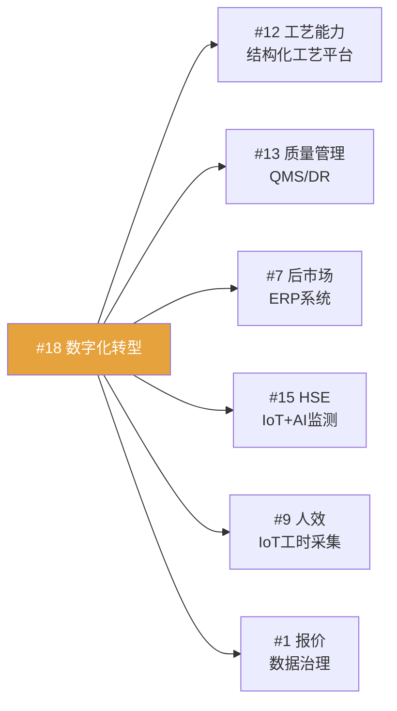

# 培元—创新与数字化

> [!abstract] 概述
> 方针#17（精益创新）+ ==方针#18（智改数转，王瑞俊主责）== + 方针#19（长期储备），共7项核心举措。#18是用户直接负责的核心方针。

## 方针#17：精益创新

### 举措1：STP设计源头改善（陈晓春）

| 维度 | 目标 |
|------|------|
| 衡量指标 | 特罐模块化覆盖率 ==0% → 20%== |

**STP方法论：** 分类（Segmentation）→ 聚焦（Targeting）→ 定位（Positioning）

**里程碑：**
- [ ] 【4月】确定2-3种重点特种产品，启动模块化开发
- [ ] 【6-10月】完成重点产品模块化开发工作的70%
- [ ] 【7月30日】启动模块化选配应用，建立覆盖率跟踪机制
- [ ] 【12月】复盘，固化成果

### 举措2：新产品开发路线图（陈晓春）

| 维度 | 目标 |
|------|------|
| 衡量指标 | 新产品开发数量累计 > ==5项== |

| 产品 | 预计完成时间 |
|------|-------------|
| 核聚变氦气罐 | 【3月】✅ |
| 新一代ISO罐箱 | 【6月】 |
| 浓硫酸铁路罐箱 | 【9月】 |
| 聚氨酯清洗剂 | 【10月】 |
| 铝合金罐箱 | 【12月】 |

### 举措3：供应商协同创新（刘建中）

- 打造除价格之外的独特原材料竞争力
- 供应链创新课题

---

## 方针#18：智改数转（==王瑞俊主责==）

> [!important] 这是用户直接负责的核心方针
> 数字化转型是多条方针的使能基础，辐射 #12工艺、#13质量、#7后市场、#9人效、#15HSE 等。

| 维度 | 目标 |
|------|------|
| 衡量指标 | ==业务信息化覆盖率100%==（+工艺、质量、仓储） |
| 责任人 | ==王瑞俊== |

### 举措1：五大信息系统建设

| 系统 | 覆盖领域 | 关联方针 |
|------|----------|----------|
| ==结构化工艺平台== | 工艺标准化/自动化/数字化 | #12 工艺能力 |
| ==IoT工业互联网== | 设备联网/数据采集/监控 | #15 HSE、#9 人效 |
| 后市场ERP系统 | 堆场运营管理 | #7 后市场布局 |
| ==QMS质量系统== | 全价值链质量管控 | #13 质量管理 |
| DR探伤系统 | 无损检测数字化 | #13 质量管理 |

**里程碑：**
- [x] 【3月】完成信息化建设规划 ✅
- [ ] 【4-6月】完成IoT项目招标、结构化工艺立项、QMS立项招标
- [ ] 【9月】整体完成率60%
- [ ] 【12月】完成率90%，实现业务信息化覆盖率100%

### 举措2：数字化转型蓝图 + 决策融合

> [!tip] 决策融合场景
> 按照规划进行决策融合场景开发和运用，==赋能决策层==。这与 [[采购优化 MOC|采购优化]] 项目中的运筹优化决策模型一脉相承。

- 制订数字化转型蓝图
- 决策融合场景识别与开发
- 试点运用，持续迭代

### 举措3：公司级数据治理

- 根据蓝图方案启动==定向数据治理==
- 明确数据责任人制度（方针讨论会决议）
- 为数字化提供基础

> [!example] 数据治理与报价准确率
> 方针#1举措4（报价准确率>95%）的"数据+算法"底层逻辑，依赖数据治理的推进。

### 年度重点行动计划（12项，2026-04更新）

> [!info] 数据来源
> 桌面文件《年度重点行动计划-数智化.xlsx》，2026-04-02更新。总预算约 ==1,035万元==（含募投项目7项、技改专项2项、年度费用预算3项）。

#### 项目总览

| # | 项目 | 类型 | 预算(万) | 资金来源 | 责任人 | 上线目标 |
|---|------|------|---------|---------|--------|---------|
| 1 | ==IOT项目== | 固本 | 190 | 募投 | 马姜龙 | 10月 |
| 2 | SAP精耕项目 | 固本 | 60 | 技改专项 | 钱莉 | 12月 |
| 3 | ==QMS项目== | 固本 | 70 | 募投 | 姜琦 | 11月 |
| 4 | ==数据治理项目== | 固本 | 200 | 年度费用 | 蒋志强 | 12月 |
| 5 | ==数智化整体规划== | 固本 | 100 | 年度费用 | — | 11月 |
| 6 | 合同管理项目（板块试点） | 固本 | 70 | 技改专项 | 李榕 | 12月 |
| 7 | ==堆场运营管理平台== | 固本 | 100 | 募投 | 许诺 | 10月 |
| 8 | ==DR探伤AI评片== | 固本 | 60 | 募投 | 姜琦 | 9月 |
| 9 | 双碳数字化二期 | 固本 | 30 | 募投 | 马姜龙 | 9月 |
| 10 | ==AI应用探索== | 固本 | 75 | 募投 | 全员 | 10月 |
| 11 | WPS 365应用推广 | 固本 | 10 | 年度费用 | 居山路 | 7月 |
| 12 | UPS系统升级改造 | 固本 | 70 | 募投 | 王焱 | 6月 |

#### 项目详情

**1. IOT项目实施（马姜龙 | 190万 | 募投）**

核心要点：
- 导入统一物联数采技术底座
- 以标罐为试点，构建精细化运营数据分析模型
- 形成可横向复制的自主开发实施能力，覆盖特罐、碳罐、封头等车间

目标值：设备利用率提升>20%、能耗成本降低>5%、生产效率提升>10%

现状：现有数采工具多、集成复杂、订阅费高

---

**2. SAP精耕项目（钱莉 | 60万 | 技改专项）**

核心要点：
- 细化金属加工中心物料编码、计划、成本核算模型
- 采购订单交货计划系统化，提高MRP及齐套分析准确率
- 基于作业成本模型，对接结构化工艺管理

目标值：金属加工中心成本效率精细化核算、供应链指标精细化动态化

现状：金属加工中心刚成立，核算体系尚未建立

---

**3. QMS项目实施（姜琦 | 70万 | 募投）**

核心要点：
- 打造"统一质量管理平台"
- 质量标准可量化，转化为可测量可验证指标，QMS固化
- 全面质量管理（策划→执行→检查→改进），打通MES/ERP/SRM

目标值：质量管理全域流程数字化

现状：大量数据纯手工整理、流程颗粒度较粗

---

**4. 数据治理项目实施（蒋志强 | 200万 | 年度费用）**

核心要点：
- 制定数据治理三年规划，建立管理体系（组织/制度/流程/标准）
- 部署面向未来的数据仓库，整合IT与OT数据
- 梳理五级指标体系，构建企业高质量发展数字画像

目标值：构建高质量数据和多维数字画像

现状：系统分散、标准不统一、数据质量参差不齐

---

**5. 数智化整体规划（100万 | 年度费用）**

核心要点：构建==流程贯通、数据同源、模型驱动、AI赋能==的全新智能制造体系
- 全系统深度集成与业务流程贯通
- APS高级计划与排程（多品种/小批量/插单/产能负荷/物料齐套/工装约束）
- IoT数字孪生："人记系统" → "系统管人"
- 智慧供应链：JIT配送、全库存AI计算、慢动预警、齐套率提升
- 新一代技术赋能：AI、低代码、知识图谱、RPA
- 智能决策与自主优化平台

目标值：综合成本降≥10%、库存周转率提升≥15%、OEE≥80%、生产周期缩短25%+、在制品下降20%+、数据一致性≥99%、异常响应缩短50%

现状：已有初步数字化基础，需整体规划分步推进

---

**6. 合同管理项目（李榕 | 70万 | 技改专项 | 板块试点）**

核心要点：
- 合同全生命周期统一管控（起草→评审→审批→盖章→履约→变更→结算→归档）
- 风险前置：信用/账期/技术/法务条款强制评审
- 与ERP/财务/PLM/OA集成，一次录入、全程共享

目标值：合同标准文本使用率≥85%，异常条款须经四级审批

---

**7. 堆场运营管理平台（许诺 | 100万 | 募投）**

核心要点：
- 导入低代码平台，平替现有罐联产品
- 全业务流程线上闭环（预进场→验箱→清洗→估价→维修→领料→复检→出场结算）
- 移动端规范现场操作，系统卡控关键节点
- 固化客户费率合同和SOP

目标值：平替现有平台，完全自主可控

现状：嘉兴/连云港堆场用第三方平台，扩展慢、数据风险不可控

---

**8. DR探伤AI辅助评片（姜琦 | 60万 | 募投）**

核心要点：
- DR图片统一存储、按车间/工作令/生产号分类检索
- 自动计算分辨率/灵敏度/灰度/信噪比，智能增强
- 基于国标/欧标/美标，AI缺陷定性/定位/定量/定级

目标值：评片节拍提升50%+、专业人员减少20%

现状：完全依赖人工专业经验

---

**9. 双碳数字化二期（马姜龙 | 30万 | 募投）**

核心要点：
- 对接PLM（产品工艺路线）、IOT（实时能耗）、MES（完工信息）
- 基于主流因子库，动态完成产品/订单碳核算

目标值：基于动态数据的产品碳核算

现状：人工手工定期导入能耗数据，依赖IOT项目提供动态数据

---

**10. AI应用探索（全员 | 75万 | 募投）**

核心要点：
- 基于现有平台延伸AI场景：PLM设计智能化、工艺智能化、HSE危险源识别、TMS路径优化
- 基于==中集千问==平台开发：存货运营AI指挥中心、供应链AI决策塔等

目标值：AI应用场景>5个（领航级智能工厂要求覆盖60%）

现状：中集千问底座已成熟，具备场景开发前提

---

**11. WPS 365应用推广（居山路 | 10万 | 年度费用）**

核心要点：
- 400个WPS普通用户升级旗舰版，启用AI能力
- 150个O365用户中50人切换WPS，降低成本

目标值：office采购成本下降30%、满足合规要求

---

**12. 数据中心机房UPS升级改造（王焱 | 70万 | 募投）**

核心要点：
- UPS主机更换（多模块冗余）
- 电池组更换（续航>4小时）
- 部署环境监测系统（7×24感知，短信/电话预警）

目标值：UPS续航>4小时、主机冗余

现状：电池仅支持40分钟、主机已用12年（一块控制板故障）

### 数字化与其他方针的使能关系

---

## 方针#19：长期能力储备（谭彦杰）

- 搜寻并牵头创新业务课题
- 形成后续新增长点
- 与方针#8（并购）协同

## Q1 董事会专题：数字化与AI

> [!info] 26年一季度董事会分享
> 王瑞俊在一季度董事会做了《数字化、AI技术在公司中的运用》专题分享，详见桌面文件。

## 项目执行看板（2026-04-21 更新）

> [!info] 数据来源
> `Desktop/资料更新/数字化项目情况.xlsx`，2026-04-21 提取。共跟踪10个项目，覆盖12项计划中的10项（缺数智化整体规划、AI应用探索）。

### 总体进度概览

| # | 项目 | 责任人 | 当前阶段 | 整体进度 | 状态 |
|---|------|--------|---------|---------|------|
| 8 | DR探伤AI辅助评片 | 姜琦 | 立项/供应商选型 | ~17% | 🟡 推进中 |
| 3 | QMS质量系统 | 姜琦 | 立项/供应商选型 | ~4% | 🟡 推进中 |
| 1 | IOT项目 | 马姜龙 | 立项中 | 0% | 🔴 未启动 |
| 9 | 双碳数字化二期 | 马姜龙 | 立项中 | 0% | 🔴 未启动 |
| 2 | SAP精耕项目 | 钱莉 | 需求梳理 | 0% | 🟡 计划中 |
| 7 | 堆场运营管理系统 | 许诺 | 立项中 | 0% | 🔴 未启动 |
| 6 | 合同管理 | 李榕 | 立项中 | 0% | 🔴 未启动 |
| 11 | WPS替代Office | 居山路 | 合同签订 | 0% | 🟡 推进中 |
| 4 | 数据治理项目 | 蒋志强 | 前期准备（延期） | 0% | 🔴 红色预警 |
| 12 | UPS系统升级改造 | 王焱 | 立项中 | 0% | 🟡 计划中 |

### 4月底前关键截止任务

| 截止日期 | 项目 | 任务 | 负责人 | 风险 |
|---------|------|------|--------|------|
| 04-21 | IOT | 立项申请 + 供应商寻源/交流/POC | 马姜龙 | ⚠️ 今日截止 |
| 04-21 | 双碳二期 | 立项申请 + 供应商选型全流程 | 马姜龙 | ⚠️ 今日截止 |
| 04-23 | 合同管理 | 立项申请 | 李榕 | ⚠️ 2天内 |
| 04-24 | DR探伤 | POC环境搭建✅ + 供应商准入资料收集 | 姜琦 | 🟡 进行中 |
| 04-24 | 堆场运营 | 立项申请 | 许诺 | ⚠️ 3天内 |
| 04-28 | UPS升级 | 立项申请 | 王焱 | 🟡 7天内 |
| 04-30 | DR探伤 | 供应商准入流程 | 姜琦 | 🟡 |
| 04-30 | QMS | 供应商寻源/交流/POC✅/准入 | 姜琦 | 🟡 |
| 04-30 | WPS | 合同签订 | 居山路 | 🟡 |
| 04-30 | 数据治理 | 供应商预研 + 需求评审（已延期） | 蒋志强 | 🔴 |

### 各项目关键节点详情

**DR探伤AI辅助评片**（进度最快）
- ✅ 立项申请（04-20完成）
- ✅ 供应商寻源/交流/POC环境搭建（04-20完成）
- ⏳ 供应商准入资料收集→准入流程→招投标（04-24~04-30）
- 📅 合同签订目标：05-15 | 启动会：05-29 | 上线：09月

**QMS质量系统**
- ✅ POC环境搭建（04-20完成）
- ⏳ 立项申请（04-17计划，未完成）
- 📅 选型完成：05-15 | 启动会：05-29 | 上线：11月

**IOT项目**（优先级最高，多项目基础依赖）
- ⏳ 全部任务0%，立项+选型计划均已至截止日（04-21）
- 📅 蓝图汇报：06-10 | 开发：08-31 | 上线：11月

**数据治理项目**（🔴 重点关注）
- 前期准备计划03-29截止，实际0%进度
- 供应商预研、需求评审均截止04-30，尚未启动
- 📅 立项：04-30 | 项目启动：05-31 | 上线：12月

---

## 关键决策点

> [!warning] 需关注
> 1. ==12个项目同时推进==，总预算1,035万，4-6月密集启动招标/立项
> 2. 募投项目7项须在2026年12月底前完成，进度刚性约束
> 3. 数据治理（200万最大单项）需建立数据责任人制度，跨部门推进阻力大
> 4. IOT是多项目基础依赖（双碳二期、AI应用均依赖IOT数据），须优先保障
> 5. 数智化整体规划尚无明确责任人，需尽快落实
> 6. AI应用探索涉及全员（6人），协调复杂度高
> 7. UPS升级（6月）和WPS推广（7月）是最早到期项目

## 相关链接

- [[2026年公司方针总览]] — 方针#17#18#19定位
- [[总经理要求与战略目标]] — "以科技谋未来"主题
- [[固本—制造与HSE]] — 使能对象（#12#13#15）
- [[减支—成本领先]] — 使能对象（#9人效）
- [[双碳数字化讨论会 2026-01-07]] — 双碳二期 + IoT蓝图
- [[方针细化讨论会 2026-03-06]] — 数据责任人制度
- [[采购优化 MOC]] — 决策融合场景实例
- [[26年工作区 MOC|← 返回工作区]]
