# CLGO知识库 MOC

> [!abstract] 概述
> 上海交通大学==CLGO（China Leaders for Global Operations）==硕士项目的完整知识体系索引。涵盖14门课程、咨询方法论和学位论文，按7个知识领域组织。

## 知识图谱

```mermaid
graph TB
    MOC["🎓 CLGO知识库"]
    
    D1["运营与供应链"]
    D2["数据分析与决策"]
    D3["项目与质量管理"]
    D4["战略与领导力"]
    D5["产品与创新"]
    D6["咨询方法论"]
    D7["学位论文与实践"]
    
    MOC --> D1
    MOC --> D2
    MOC --> D3
    MOC --> D4
    MOC --> D5
    MOC --> D6
    MOC --> D7
    
    D1 --> N1["运营战略"]
    D1 --> N2["运营管理"]
    D1 --> N3["制造流程与系统"]
    
    D2 --> N4["数据挖掘与商业分析"]
    D2 --> N5["系统动力学"]
    D2 --> N6["工程概率与系统优化"]
    
    D3 --> N7["系统项目管理"]
    D3 --> N8["质量项目管理"]
    D3 --> N9["制造流程控制"]
    
    D4 --> N10["战略管理"]
    D4 --> N11["领导力与变革管理"]
    D4 --> N12["营销管理"]
    
    D5 --> N13["产品设计与开发"]
    D5 --> N14["区块链与新技术"]
    
    D6 --> N15["贝恩分析工具集"]
    D6 --> N16["埃森哲实施方法论"]
    D6 --> N17["BCG战略咨询框架"]
    
    D7 --> N18["硕士论文研究"]
    D7 --> N19["游学与论坛见闻"]
```

## 一、运营与供应链

| 课程 | 核心主题 | 关键框架 |
|------|----------|----------|
| [[运营战略]] | 竞争战略×运营模式 | Porter战略/运营前沿/案例分析 |
| [[运营管理]] | 数字化运营趋势 | 产品-流程矩阵/数字化转型 |
| [[制造流程与系统]] | 制造工艺与精益 | 材料/加工/成型/TPS/SPC |

## 二、数据分析与决策

| 课程 | 核心主题 | 关键框架 |
|------|----------|----------|
| [[数据挖掘与商业分析]] | ML算法与商业应用 | 分类/回归/聚类/Python/R |
| [[系统动力学]] | 复杂系统建模 | Stock-Flow/反馈环/Vensim |
| [[工程概率与系统优化]] | 统计推断与优化 | 假设检验/回归/ANOVA/优化 |

## 三、项目与质量管理

| 课程 | 核心主题 | 关键框架 |
|------|----------|----------|
| [[系统项目管理]] | 项目规划与执行 | CPM/CCM/DSM/NPI |
| [[质量项目管理]] | 问题分析与决策 | KT分析法/5 Why/根因分析 |
| [[制造流程控制]] | 统计过程控制 | SPC/Cp/Cpk/控制图/Minitab |

## 四、战略与领导力

| 课程 | 核心主题 | 关键框架 |
|------|----------|----------|
| [[战略管理]] | 战略分析与制定 | EFE/IFE/SWOT/QSPM |
| [[领导力与变革管理]] | 领导力与沟通 | 权力来源/KATA/跨文化沟通 |
| [[营销管理]] | 市场营销策划 | STP/4P/PEST/五力 |

## 五、产品与创新

| 课程 | 核心主题 | 关键框架 |
|------|----------|----------|
| [[产品设计与开发]] | 产品开发全流程 | 简约设计/用户研究/QFD |
| [[区块链与新技术]] | 区块链技术原理 | 共识机制/智能合约/供应链应用 |

## 六、咨询方法论

| 来源 | 核心主题 | 关键框架 |
|------|----------|----------|
| [[贝恩分析工具集]] | 22个分析工具 | 利润池/NPS/渗透曲线/财务分析 |
| [[埃森哲实施方法论]] | ERP实施+BPO | SAP 7模块/5阶段实施/BPO方法 |
| [[BCG战略咨询框架]] | 战略咨询案例 | BCG矩阵/麦肯锡7S/行业分析 |

## 七、学位论文与实践

| 项目 | 核心主题 | 关键内容 |
|------|----------|----------|
| [[硕士论文研究]] | 港铁能效优化 | 能耗建模/NPI项目/工程失败分析 |
| [[游学与论坛见闻]] | 行业洞察与交流 | 智能制造4.0/MIT游学/企业参访 |

## 与26年工作区的知识桥接

> [!tip] CLGO知识 → 工作实践
> - **运营+供应链** → [[精益—工艺标准化]]、[[降本—成本优化]]
> - **数据分析** → 采购优化MILP项目、经营数据分析
> - **项目管理** → [[E项目改善跟踪]]、新产品NPI
> - **战略+营销** → [[增收—渗透率提升]]、市场策略
> - **数字化+创新** → [[培元—创新与数字化]]、IoT/ERP
> - **咨询方法论** → 战略规划、流程优化的分析工具
> - **领导力** → [[考评体系与绩效合同]]、团队管理
