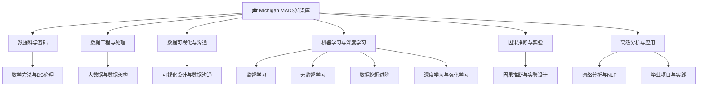

# Michigan MADS知识库 MOC

> [!abstract] 概述
> 密歇根大学==MADS（Master of Applied Data Science）==硕士项目的完整知识体系索引。涵盖26门SIADS课程，按6个知识领域组织，提取核心算法、方法论和实战洞察。

## 知识图谱

## 一、数据科学基础

| 课程 | 核心主题 | 关键框架 |
|------|----------|----------|
| [[数学方法与DS伦理]] | 线性代数/SVD/梯度下降/AI伦理 | 特征值分解/图像压缩/Bootstrap |

**覆盖课程：** S501 Being Data Scientist, S502 Math Methods, S503 Data Ethics, S602 Math Methods II

## 二、数据工程与处理

| 课程 | 核心主题 | 关键框架 |
|------|----------|----------|
| [[大数据与数据架构]] | MapReduce/Spark/SQL规范化/JSON | mrjob/PySpark RDD/PostgreSQL |

**覆盖课程：** S515 Efficient Data Processing, S516 Big Data, S611 Advanced Data Architecture

## 三、数据可视化与沟通

| 课程 | 核心主题 | 关键框架 |
|------|----------|----------|
| [[可视化设计与数据沟通]] | 图表选择/交互设计/不确定性/报告写作 | Altair/Matplotlib/Bootstrap可视化 |

**覆盖课程：** S521 Visual Exploration, S522 Info Viz I, S523 Communication, S524 Presenting Uncertainty, S622 Info Viz II

## 四、机器学习与深度学习

| 课程 | 核心主题 | 关键框架 |
|------|----------|----------|
| [[监督学习]] | 回归/分类/评估/树模型 | 多项式回归/SVC/GBDT/GridSearchCV |
| [[无监督学习]] | 降维/聚类/主题模型/半监督 | PCA/K-Means/NMF/LabelSpreading |
| [[数据挖掘进阶]] | N-gram/HMM/时间序列/预测 | ARIMA/VAR/DTW/Granger因果 |
| [[深度学习与强化学习]] | 深度学习/Q-Learning/SARSA | Bellman方程/线性函数近似 |

**覆盖课程：** S532 Data Mining I, S542 Supervised Learning, S543 Unsupervised Learning, S632 Data Mining II, S642 Deep Learning, S644 Reinforcement Learning

## 五、因果推断与实验

| 课程 | 核心主题 | 关键框架 |
|------|----------|----------|
| [[因果推断与实验设计]] | 潜在结果/A-B测试/OLS | 协变量平衡/ATE/实验设计 |

**覆盖课程：** S630 Causal Inference, S631 Experiment Design and Analysis

## 六、高级分析与应用

| 课程 | 核心主题 | 关键框架 |
|------|----------|----------|
| [[网络分析与NLP]] | 图论/中心性/链接预测/讽刺检测 | NetworkX/LIME/TF-IDF |
| [[毕业项目与实践]] | 端到端数据分析/重复购买预测 | 时序分解/中文NLP/ML Pipeline |

**覆盖课程：** S652 Network Analysis, S655 NLP, S680 Learning Analytics, S591 Milestone I, S601 Qualitative Inquiry, S696 Milestone II

## 课程全景表（26门）

| 编号 | 课程名称 | 领域 | 笔记链接 |
|------|----------|------|----------|
| S501 | Being Data Scientist | 基础 | [[数学方法与DS伦理]] |
| S502 | Math Methods | 基础 | [[数学方法与DS伦理]] |
| S503 | Data Ethics | 基础 | [[数学方法与DS伦理]] |
| S515 | Efficient Data Processing | 工程 | [[大数据与数据架构]] |
| S516 | Big Data | 工程 | [[大数据与数据架构]] |
| S521 | Visual Exploration of Data | 可视化 | [[可视化设计与数据沟通]] |
| S522 | Information Visualization I | 可视化 | [[可视化设计与数据沟通]] |
| S523 | Communication of Data Science | 可视化 | [[可视化设计与数据沟通]] |
| S524 | Presenting Uncertainty | 可视化 | [[可视化设计与数据沟通]] |
| S532 | Data Mining I | ML | [[监督学习]] |
| S542 | Supervised Learning | ML | [[监督学习]] |
| S543 | Unsupervised Learning | ML | [[无监督学习]] |
| S591 | Milestone I | 应用 | [[毕业项目与实践]] |
| S601 | Qualitative Inquiry in DS | 应用 | [[毕业项目与实践]] |
| S602 | Math Methods II | 基础 | [[数学方法与DS伦理]] |
| S611 | Advanced Data Architecture | 工程 | [[大数据与数据架构]] |
| S622 | Information Visualization II | 可视化 | [[可视化设计与数据沟通]] |
| S630 | Causal Inference | 因果 | [[因果推断与实验设计]] |
| S631 | Experiment Design & Analysis | 因果 | [[因果推断与实验设计]] |
| S632 | Data Mining II | ML | [[数据挖掘进阶]] |
| S642 | Introduction to Deep Learning | ML | [[深度学习与强化学习]] |
| S644 | Reinforcement Learning | ML | [[深度学习与强化学习]] |
| S652 | Network Analysis | 应用 | [[网络分析与NLP]] |
| S655 | NLP | 应用 | [[网络分析与NLP]] |
| S680 | Learning Analytics | 应用 | [[网络分析与NLP]] |
| S696 | Milestone II | 应用 | [[毕业项目与实践]] |

## 与其他知识库的桥接

> [!tip] MADS知识 -> 工作实践 & CLGO知识
> - **监督/无监督学习** -> [[数据挖掘与商业分析]]（CLGO），Michigan更深入算法实现
> - **时间序列预测** -> [[Rayray课代表的数字化管理(8) - 预测那些事儿1|数字化管理课：预测篇]]，Michigan更理论，管理课更应用
> - **实验设计** -> [[工程概率与系统优化]]（CLGO），重叠假设检验/ANOVA
> - **网络分析** -> [[区块链与新技术]]（CLGO），补充图论基础
> - **可视化** -> [[Rayray课代表的数字化管理课(4) - 透过数据理解真实世界(1) 数据可视化、规范与陷阱|数字化管理课：可视化篇]]
> - **因果推断** -> [[培元—创新与数字化]]（26年工作区），数据驱动决策的理论支撑
> - **采购优化MILP** -> [[采购优化 MOC]]（运筹优化知识库），梯度下降/优化理论为基础

## 源文件位置

- 课程资料：`C:\Users\01455310\OneDrive\Michigan\`
- 学位证书：`C:\Users\01455310\OneDrive\Michigan\1452815_eDiploma.pdf`
