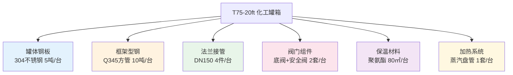

# BOM 物料清单爆炸

> [!abstract] 定义
> BOM（Bill of Materials）爆炸是从==成品需求反推各层级物料消耗量==的过程。在[[罐箱采购优化模型]]中，每台化工罐箱由多种物料组成，通过 BOM 用量表将生产计划"爆炸"为物料采购需求。

## BOM 结构示例



## 消耗计算公式

$$
\text{consumed}_{m,t} = \sum_{p \in P} \text{prod}_{p,t} \times \text{qty\_per\_unit}_{p,m}
$$

- $\text{prod}_{p,t}$：成品 $p$ 在 $t$ 周的生产量
- $\text{qty\_per\_unit}_{p,m}$：每台成品 $p$ 消耗物料 $m$ 的数量

> [!example] 具体计算
> 若本周生产 T75-20ft 3台 + T75-40ft 2台：
> - 304钢板消耗 = 3×5 + 2×8 = ==31 吨==
> - Q345方管消耗 = 3×10 + 2×15 = ==60 吨==
> - 法兰消耗 = 3×4 + 2×6 = ==24 件==

## 6 类物料分类

| 类别 | 典型物料 | 采购周期 | 特点 |
|------|----------|----------|------|
| 罐体钢板 | 304/316L不锈钢 | 6~8周 | 高价值、长周期 |
| 框架型钢 | Q345方管/槽钢 | 2~3周 | 用量大、周期短 |
| 法兰接管 | DN150/DN200 | 4~6周 | 标准件 |
| 阀门组件 | 底阀/安全阀/紧急切断阀 | ==8~12周== | 周期最长 |
| 保温材料 | 聚氨酯/岩棉 | 2~4周 | 体积大 |
| 加热系统 | 蒸汽盘管/电加热 | 4~6周 | 定制件 |

> [!danger] 关键风险
> ==阀门组件的 8~12 周采购周期==是整条供应链的瓶颈。模型中通过提前下单（lead time 偏移）和安全库存双重保障来对冲断供风险。

## 在模型中的实现

```python
# solve_tank.py 中的 BOM 数据结构
@dataclass
class BomEntry:
    product_id: str    # 成品编号
    material_id: str   # 物料编号
    qty_per_unit: float  # 单台消耗量

# 消耗约束
for m in materials:
    for t in periods:
        consumed = pulp.lpSum(
            prod[p, t] * bom[(p, m)].qty_per_unit
            for p in products if (p, m) in bom
        )
        model += I[m, t] == I[m, t-1] + x[m, order_t] - consumed
```

## 相关链接

- [[安全库存与采购周期]] — 长周期物料的库存策略
- [[罐箱采购优化模型]] — BOM 爆炸在罐箱模型中的完整应用
- [[采购优化 MOC|← 返回目录]]
