# 安全库存与采购周期

> [!abstract] 核心问题
> 采购有**提前期**（Lead Time），从下单到到货需要时间。如何确保在等待到货期间不会断供？答案是 ==安全库存 + 提前期建模==。

## 库存平衡方程

### 无 Lead Time（MVP模型）

$$
I_{m,t} = I_{m,t-1} + x_{m,t} - \text{consumed}_{m,t}
$$

> 下单即到货，当期采购当期可用。

### 有 Lead Time（罐箱模型）

$$
I_{m,t} = I_{m,t-1} + x_{m, t - \text{lt}_m + 1} - \text{consumed}_{m,t}
$$

> [!important] 关键区别
> $x_{m, t-\text{lt}_m+1}$ 表示在第 $t$ 期到达的货物，==实际上是在 $\text{lt}_m - 1$ 个周期前下的单==。模型需要在需求发生前足够早地安排采购。

## 各类物料采购周期

```mermaid
gantt
    title 物料采购周期对比（周）
    dateFormat X
    axisFormat %s周

    section 罐体钢板
    6~8周 :0, 8

    section 框架型钢
    2~3周 :0, 3

    section 法兰接管
    4~6周 :0, 6

    section 阀门组件
    8~12周 :crit, 0, 12

    section 保温材料
    2~4周 :0, 4

    section 加热系统
    4~6周 :0, 6
```



## 安全库存的设定

$$
\text{SS}_m \geq \text{avg\_weekly\_consumption}_m \times \text{safety\_factor}
$$

| 物料类别 | Safety Factor | 原因 |
|----------|---------------|------|
| 长周期物料（阀门） | 2~3 周用量 | 补货慢，断供代价高 |
| 短周期物料（型钢） | 1 周用量 | 补货快，灵活调整 |
| 高价值物料（钢板） | 1.5 周用量 | 平衡资金占用与断供风险 |

> [!tip] 与时间序列的关联
> [[加餐 - 时间序列中的数据科学|时间序列分析]]中提到的==季节性分解==可用于更精准地预测需求波动，从而动态调整安全库存水平。静态 SS 是保守策略，动态 SS 是进阶策略。

## 在模型中的约束实现

```python
# 安全库存约束
for m in materials:
    for t in periods:
        model += I[m, t] >= safety_stock[m], f"SS_{m}_{t}"

# Lead time 偏移的库存平衡
for m in materials:
    lt = lead_time[m]
    for t in periods:
        order_period = t - lt + 1
        if order_period >= 0:
            inflow = x[m, order_period]
        else:
            inflow = 0  # 初始期前的订单视为已到货（初始库存覆盖）
        model += I[m,t] == I[m,t-1] + inflow - consumed[m,t]
```

## 相关链接

- [[BOM物料清单爆炸]] — 消耗量计算（consumed 的来源）
- [[罐箱采购优化模型]] — 52 周多物料库存规划实战
- [[加餐 - 时间序列中的数据科学|理论：时间序列分析]] — 需求预测与安全库存的关系
- [[采购优化 MOC|← 返回目录]]
