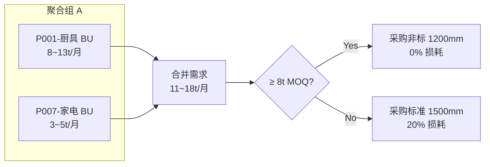

# 采购聚合策略

> [!abstract] 定义
> 将多个事业部（BU）对同一规格材料的需求**合并采购**，以突破单一 BU 无法独立达到的非标材料 MOQ 门槛，从而享受更低的损耗率。

## 问题背景

在[[钢材采购优化模型]]中：
- 非标板材（定尺宽度）可将损耗从 20% 降至接近 0%
- 但非标板材有 **MOQ 门槛**（如 8 吨/次）
- 单个 BU 的月度需求可能仅 3~5 吨，==无法独立达标==

## 聚合逻辑



## 6 个聚合组案例

| 聚合组 | 产品 | BU | 规格需求 | 单独需求 | 聚合后 |
|--------|------|----|----------|----------|--------|
| A | P001 + P007 | 厨具+家电 | 1200×0.5mm BA | 8t + 4t | ==12t > 8t MOQ== |
| B | P002 + P008 | 厨具+家电 | 1000×0.8mm 2B | 6t + 3t | 9t > 8t MOQ |
| C | P003 + P009 | 建材+电梯 | 1219×1.0mm BA | 10t + 5t | 15t > 8t MOQ |
| D | P004 + P010 | 建材+电梯 | 800×1.2mm #4 | 7t + 4t | 11t > 8t MOQ |
| E | P005 + P011 | 汽车+厨电 | 1500×0.6mm 2B | 5t + 3t | 8t = MOQ |
| F | P006 + P012 | 汽车+厨电 | 600×2.0mm BA | 4t + 2t | 6t < 8t MOQ |

> [!warning] 聚合组 F 的特殊情况
> 聚合后仍不足 MOQ 时，模型会自动选择标准材料。==聚合不是万能的==，取决于需求规模与 MOQ 的比例关系。

## 在模型中的实现

```python
# solve_steel.py 中的聚合索引构建
compat_by_prod = defaultdict(list)
# {(bu, prod_id): [(material, yield_rate, trim_loss), ...]}

# 聚合组定义
AGG_GROUPS = {
    'A': [('BU-厨具', 'P001'), ('BU-家电', 'P007')],
    'B': [('BU-厨具', 'P002'), ('BU-家电', 'P008')],
    # ...
}

# 聚合需求 = 组内所有产品的需求之和
agg_demand[group, t] = sum(demand[bu, prod, t]
                           for (bu, prod) in AGG_GROUPS[group])
```

## 聚合策略的价值量化

> [!success] 钢材模型最终结果
> - 非标采购占比：==55.4%==（得益于聚合策略）
> - 综合损耗率：==6.79%==（无聚合时约 15~20%）
> - 年化节约估算：损耗率降低 ~10% × ¥12.78M ≈ ==¥127万/年==

## 相关链接

- [[损耗率与开料优化]] — 非标材料为什么损耗低
- [[钢材采购优化模型]] — 聚合策略的完整实战应用
- [[敏感性分析]] — MOQ 门槛变化对聚合效果的影响
- [[采购优化 MOC|← 返回目录]]
