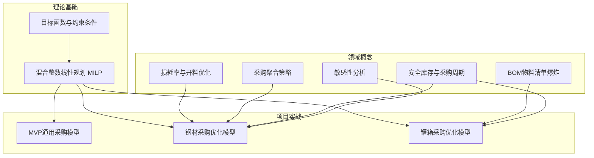

# 采购优化知识库

> [!abstract] 概述
> 本知识库沉淀了**采购决策优化**项目中的领域知识与实战经验。核心方法：利用==混合整数线性规划（MILP）==对采购成本、库存持有、材料损耗进行全局最优求解。涵盖三个业务模型（MVP通用/钢材/罐箱），从理论概念到代码实现的完整知识体系。

## 知识体系

## 📐 核心概念

| 概念 | 一句话说明 | 应用模型 |
|------|-----------|----------|
| [[混合整数线性规划 MILP]] | 含连续+整数变量的线性优化求解框架 | 全部 |
| [[目标函数与约束条件]] | min(采购+持有+损耗+惩罚) s.t. 需求/库存/预算 | 全部 |
| [[损耗率与开料优化]] | 板材开料宽度差产生的 trim loss 及经济性分析 | 钢材 |
| [[采购聚合策略]] | 跨事业部合并需求突破 MOQ 门槛 | 钢材 |
| [[BOM物料清单爆炸]] | 成品→物料的多层消耗量展开 | 罐箱 |
| [[安全库存与采购周期]] | Lead time 建模与库存平衡方程 | 钢材/罐箱 |
| [[敏感性分析]] | 多维参数扰动下的方案鲁棒性验证 | 钢材 |

## 🏭 项目实战

| 模型 | 规模 | 关键结果 | 源代码 |
|------|------|----------|--------|
| [[MVP通用采购模型]] | 2产品 × 2物料 × 12期 | 通用模板，替代用料与质量惩罚 | `solve.py` |
| [[钢材采购优化模型]] | 12产品 × 15板材 × 12期 | ==¥12,778,965== / 6.79%损耗 / 55.4%非标 | `solve_steel.py` |
| [[罐箱采购优化模型]] | 4成品 × 15物料 × 52周 | BOM驱动、6类物料、周度→月度计划 | `solve_tank.py` |

## 🔗 与理论课程的关联

> [!info] 理论→实践映射
> 本知识库中的实战内容与[[瑞俊的数字化管理课 MOC|数字化管理课]]的理论章节形成闭环：

| 理论文章 | 对应实战知识 |
|----------|-------------|
| [[Rayray课代表的数字化管理课(2) - 前言2决策之殇\|前言2：决策之殇]] | [[目标函数与约束条件]]（多目标→约束转化） |
| [[Rayray课代表的数字化管理课(3) - 前言3 从数据科学角度看决策优化问题\|前言3：决策优化]] | [[混合整数线性规划 MILP]]（受约束优化的工程实现） |
| [[Rayray课代表的数字化管理(8) - 预测那些事儿3 - 机器学习结合运筹优化\|预测3：ML+运筹优化]] | [[钢材采购优化模型]] + [[敏感性分析]] |
| [[加餐 - 时间序列中的数据科学\|加餐：时间序列]] | [[安全库存与采购周期]]（时序需求下的库存规划） |

## 🛠️ 技术栈

| 工具 | 用途 |
|------|------|
| Python + PuLP | MILP 建模与求解 |
| CBC Solver | 开源混合整数求解器 |
| openpyxl | Excel 数据读写 |
| python-pptx | 结果报告生成 |
